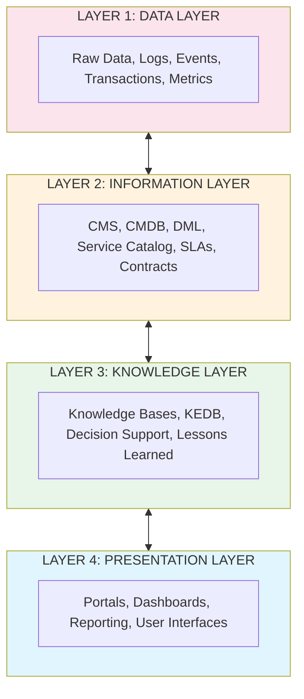
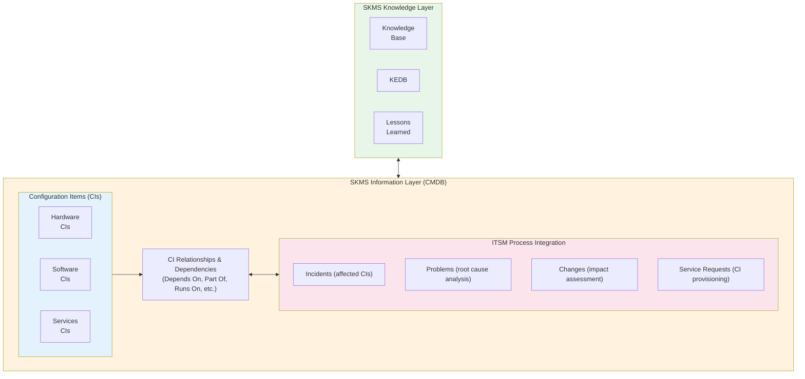
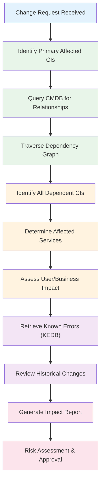
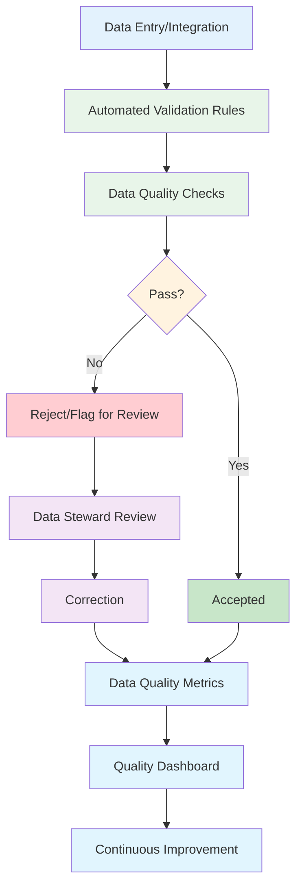

# Chapter 7: Service Knowledge Management System (SKMS)

## Learning Objectives

After completing this chapter, you will be able to:
- Understand the ITIL Service Knowledge Management System (SKMS) concept and its strategic importance
- Identify and implement the four layers of the SKMS architecture
- Integrate the SKMS with the Configuration Management System (CMS) and CMDB
- Evaluate and select SKMS platforms based on organizational requirements
- Design CMDB-SKMS integration patterns for effective service management
- Implement comprehensive SKMS governance frameworks
- Measure SKMS effectiveness through key metrics and analytics
- Align SKMS with ITIL 4 service management practices

---

## Understanding the SKMS

### What is the SKMS?

The Service Knowledge Management System (SKMS) is the comprehensive set of tools and databases used to manage knowledge and information throughout the IT service lifecycle. It represents the complete body of knowledge accessible to the IT service provider, forming the technical foundation for effective knowledge management.

**ITIL Definition:**
> "The Service Knowledge Management System (SKMS) is a set of tools and databases that are used to manage knowledge, information and data. The SKMS includes the service knowledge management tools, such as the Configuration Management System (CMS), which also includes the Configuration Management Database (CMDB)."

The SKMS extends beyond simple data storage to create an integrated knowledge ecosystem that supports informed decision-making, consistent service delivery, and continuous learning across the organization.

### Strategic Importance

The SKMS serves as the nervous system of IT service management, enabling:

| Strategic Value | Description | Business Impact |
|----------------|-------------|-----------------|
| **Digital Transformation Enabler** | Provides knowledge foundation for service automation | Accelerates digitalization initiatives |
| **Organizational Memory** | Preserves institutional knowledge across personnel changes | Reduces knowledge loss, maintains continuity |
| **Service Intelligence** | Enables data-driven insights and predictive capabilities | Improves service quality and proactive management |
| **Compliance Framework** | Maintains audit trails and documentation | Supports regulatory compliance, reduces risk |
| **Innovation Platform** | Surfaces patterns and opportunities for improvement | Drives continuous service improvement |

### SKMS Purpose and Benefits

| Purpose | Description |
|---------|-------------|
| **Centralized Knowledge** | Single source of truth for service information |
| **Informed Decision Making** | Provide relevant information to support decisions |
| **Service Quality** | Enable consistent, accurate service delivery |
| **Efficiency** | Reduce time spent searching for information |
| **Knowledge Preservation** | Capture and retain organizational knowledge |
| **Risk Mitigation** | Document known issues and solutions |

### SKMS Benefits by Stakeholder

| Stakeholder | Benefits |
|-------------|----------|
| **Service Desk** | Faster incident resolution, consistent answers, reduced escalations |
| **Technical Teams** | Access to configuration data, known errors, solutions, impact analysis |
| **Managers** | Performance data, trends, capacity planning, decision support |
| **Customers** | Self-service access, transparency, faster resolution |
| **Executives** | Service visibility, risk management, compliance assurance |
| **Organization** | Improved service quality, reduced costs, risk mitigation, innovation |

---

## SKMS Architecture

### The Four-Layer Model

The SKMS is structured in four hierarchical layers, each building upon the layer below. This architecture ensures separation of concerns while enabling seamless knowledge flow from raw data to actionable insights.



**Table 7.1: SKMS Four-Layer Components**

| Layer | Purpose | Key Components | Value Delivered |
|-------|---------|----------------|-----------------|
| **Data Layer** | Store raw, unprocessed facts | Event logs, transaction records, performance metrics, audit trails | Foundation for analysis |
| **Information Layer** | Contextualize data into meaningful information | CMDB, Service Catalog, Asset Register, DML, Contracts | Operational support |
| **Knowledge Layer** | Synthesize information into actionable knowledge | Knowledge Base, KEDB, Best Practices, Lessons Learned | Decision support |
| **Presentation Layer** | Deliver knowledge to users | Portals, Dashboards, Reports, Mobile Apps, APIs | User enablement |

### Layer 1: Data Layer - Foundation

**Purpose:** Store raw, unprocessed data captured from various sources as the foundation for all higher layers.

| Data Type | Description | Sources | Volume Characteristics |
|-----------|-------------|---------|----------------------|
| **Event Data** | System events, alerts, notifications | Monitoring tools, SIEM, log aggregators | High volume, real-time |
| **Transaction Data** | Service requests, incidents, changes | ITSM tools, workflow systems | Medium volume, structured |
| **Performance Data** | Metrics, measurements, KPIs | APM tools, monitoring platforms | Very high volume, time-series |
| **Configuration Data** | CI attributes, properties | Discovery tools, asset scanners | Medium volume, semi-structured |
| **Audit Data** | Changes, access logs, compliance | Audit systems, SIEM, ITSM | Medium volume, append-only |
| **User Activity** | Logins, searches, clicks, interactions | Application logs, web analytics | High volume, behavioral |

**Data Layer Characteristics:**
- High volume, granular detail
- Unstructured or semi-structured formats
- Machine-generated and automated
- Time-series and historical data
- Requires processing to extract meaning
- Often stored in data lakes or time-series databases

**Data Layer Technologies:**
- **Time-Series Databases:** InfluxDB, Prometheus, TimescaleDB
- **Log Management:** Splunk, ELK Stack, Graylog
- **Data Lakes:** Hadoop, Amazon S3, Azure Data Lake
- **Stream Processing:** Apache Kafka, Apache Flink

**Data Layer Best Practices:**

| Practice | Description | Rationale |
|----------|-------------|-----------|
| **Data Retention Policies** | Define lifecycle for different data types | Balance storage costs with compliance needs |
| **Data Quality at Source** | Validate data during collection | Prevent garbage-in-garbage-out scenarios |
| **Efficient Storage** | Use compression and tiering | Optimize cost and performance |
| **Real-Time Streaming** | Process events as they occur | Enable real-time insights and alerting |
| **Data Lineage** | Track data origin and transformations | Support audit and troubleshooting |

### Layer 2: Information Layer - Contextualization

**Purpose:** Transform raw data into meaningful, contextualized information that supports operational activities.

| Information Asset | Description | Content | Update Frequency |
|------------------|-------------|---------|------------------|
| **CMDB** | Configuration items and relationships | CIs, attributes, dependencies, topology | Real-time/continuous |
| **Service Catalog** | Available services | Service descriptions, SLAs, request forms | Monthly/quarterly |
| **Asset Register** | Physical and software assets | Asset details, ownership, location, lifecycle | Daily/weekly |
| **Supplier Database** | Vendor information | Contracts, contacts, performance, SLAs | Monthly |
| **Definitive Media Library (DML)** | Authorized software versions | Software baselines, licenses, checksums | Per release |
| **Contract Database** | Legal agreements | Terms, obligations, renewals, pricing | Ad-hoc/as needed |
| **Service Level Agreements** | Commitment documentation | Targets, penalties, reporting requirements | Quarterly/annually |

**Information Layer Characteristics:**
- Structured and organized
- Contextualized data with relationships
- Supports operational activities
- Updated regularly through defined processes
- Authoritative sources for specific domains
- Relational and graph database storage

**Information Layer Design Principles:**

| Principle | Description | Implementation |
|-----------|-------------|----------------|
| **Single Source of Truth** | One authoritative source per data type | Designate master data sources |
| **Relationship Mapping** | Capture dependencies and connections | Use graph databases or relationship tables |
| **Federated Architecture** | Integrate multiple systems | Use integration layer rather than consolidation |
| **Data Governance** | Define ownership and stewardship | Assign data owners and quality metrics |
| **Version Control** | Maintain historical versions | Implement effective-dated records |

### Layer 3: Knowledge Layer - Synthesis

**Purpose:** Provide synthesized knowledge derived from information, experience, and human expertise.

| Knowledge Asset | Description | Content | Creation Process |
|----------------|-------------|---------|------------------|
| **Knowledge Base** | Solutions and procedures | How-to guides, FAQs, troubleshooting steps | Documentation, capture |
| **Known Error Database (KEDB)** | Documented problems | Root causes, workarounds, fixes | Problem management |
| **Lessons Learned** | Project insights | Successes, failures, recommendations | Post-implementation reviews |
| **Best Practices** | Proven approaches | Standards, guidelines, templates | Expert review, validation |
| **Decision Support** | Analysis and recommendations | Impact assessments, change advisory | Analytics, expert judgment |
| **Service Intelligence** | Patterns and trends | Predictions, insights, opportunities | AI/ML, analytics |
| **Runbooks** | Operational procedures | Step-by-step instructions, automation | Technical documentation |
| **Design Patterns** | Architectural solutions | Reference architectures, blueprints | Enterprise architecture |

**Knowledge Layer Characteristics:**
- Synthesized and curated content
- Human and machine generated
- Actionable insights and guidance
- Continuously refined through feedback
- Supports decision-making and learning
- Context-aware and role-specific

**Knowledge Layer Quality Criteria:**

| Quality Dimension | Description | Measurement |
|------------------|-------------|-------------|
| **Accuracy** | Information is correct and verified | Validation rate, error reports |
| **Completeness** | All necessary information included | Coverage assessment, gap analysis |
| **Currency** | Information is up-to-date | Last update date, review cycle |
| **Relevance** | Applicable to user needs | Usage analytics, search success |
| **Accessibility** | Easy to find and understand | Time to find, comprehension tests |
| **Actionability** | Can be applied to solve problems | Resolution success rate |

### Layer 4: Presentation Layer - Delivery

**Purpose:** Deliver knowledge and information to users in appropriate formats through multiple channels.

| Presentation Type | Description | Users | Key Features |
|------------------|-------------|-------|--------------|
| **Self-Service Portal** | Customer-facing interface | End users, customers | Search, knowledge articles, request submission |
| **Agent Desktop** | Integrated workspace | Service desk, support teams | Case management, knowledge integration, collaboration |
| **Dashboards** | Visual metrics and KPIs | Managers, executives | Real-time data, drill-down, alerts |
| **Reports** | Detailed analysis | All stakeholders | Scheduled delivery, ad-hoc generation, exports |
| **Mobile Apps** | On-the-go access | Field staff, mobile users | Offline capability, camera integration, GPS |
| **APIs** | Programmatic access | Integrated systems, chatbots | RESTful, webhooks, authentication |
| **Virtual Assistants** | Conversational interface | End users, service desk | NLP, conversational flow, contextual |
| **Email Notifications** | Push communications | All users | Triggered, personalized, actionable |

**Presentation Layer Characteristics:**
- User-centric design principles
- Role-based access control
- Multiple delivery channels
- Personalized content
- Intuitive navigation
- Responsive design (mobile-friendly)
- Accessibility compliance (WCAG)

**Presentation Layer Design Considerations:**

| Consideration | Description | Best Practice |
|--------------|-------------|---------------|
| **User Experience (UX)** | Ease of use and satisfaction | User testing, feedback loops |
| **Search Capability** | Find information quickly | Faceted search, natural language, filters |
| **Personalization** | Tailor content to user | Role-based content, recommendations |
| **Performance** | Response time and speed | Caching, CDN, optimization |
| **Mobile-First** | Optimized for mobile devices | Responsive design, progressive web apps |
| **Accessibility** | Usable by all abilities | WCAG 2.1 AA compliance |

---

## SKMS Architecture Deep Dive

### Data Layer Specifications

**Storage Architecture:**

```
┌────────────────────────────────────────────────────────┐
│                  Data Layer Storage                    │
├────────────────────────────────────────────────────────┤
│  Hot Tier (Real-Time)                                  │
│  ├── Time-Series DB (Metrics, Events) [7 days]       │
│  ├── Message Queue (Streaming Data) [24 hours]        │
│  └── Cache Layer (Fast Access) [1 hour]               │
├────────────────────────────────────────────────────────┤
│  Warm Tier (Recent)                                    │
│  ├── Operational Database [90 days]                   │
│  └── Search Index [90 days]                           │
├────────────────────────────────────────────────────────┤
│  Cold Tier (Historical)                                │
│  ├── Data Warehouse [7 years]                         │
│  └── Archive Storage [per retention policy]           │
└────────────────────────────────────────────────────────┘
```

**Data Collection Patterns:**

| Pattern | Use Case | Technology | Latency |
|---------|----------|------------|---------|
| **Push** | Real-time events | Webhooks, agents | < 1 second |
| **Pull** | Polling monitoring | API polling, SNMP | 1-5 minutes |
| **Batch** | Bulk imports | ETL, file transfer | Hours/daily |
| **Stream** | Continuous data | Kafka, event streams | < 1 second |
| **Discovery** | Automated scanning | Network discovery | Hours/weekly |

### Information Layer Design

**CMDB Architecture Patterns:**

| Pattern | Description | When to Use | Pros | Cons |
|---------|-------------|-------------|------|------|
| **Centralized** | Single CMDB repository | Small organizations, simple environment | Easy to manage, consistent | Single point of failure, scaling limits |
| **Federated** | Multiple authoritative sources integrated | Large organizations, diverse systems | Scalable, flexible | Complex integration, reconciliation needed |
| **Hybrid** | Core CMDB with federated sources | Most organizations | Balance of control and flexibility | Requires careful design |
| **Virtual** | Real-time query of source systems | Dynamic environments | Always current | Performance concerns, dependency on sources |

**Service Catalog Structure:**

```
Service Catalog
├── Business Service Catalog (Customer View)
│   ├── IT Services
│   │   ├── Email Service
│   │   ├── Collaboration Service
│   │   └── Application Hosting
│   ├── Request Catalog
│   │   ├── Standard Requests
│   │   └── Service Requests
│   └── Service Portfolio
│       ├── Live Services
│       ├── Pipeline Services
│       └── Retired Services
└── Technical Service Catalog (IT View)
    ├── Infrastructure Services
    │   ├── Compute Services
    │   ├── Storage Services
    │   └── Network Services
    ├── Application Services
    │   ├── Database Services
    │   ├── Middleware Services
    │   └── Application Components
    └── Supporting Services
        ├── Monitoring Services
        ├── Backup Services
        └── Security Services
```

### Knowledge Layer Components

**Knowledge Base Architecture:**

| Component | Purpose | Content Types | Curation Model |
|-----------|---------|---------------|----------------|
| **Solutions Library** | Incident resolution | Step-by-step solutions, troubleshooting | KCS methodology |
| **Procedure Repository** | Standard processes | SOPs, work instructions, checklists | Document control |
| **FAQ Database** | Common questions | Q&A format, quick answers | Crowd-sourced, reviewed |
| **Reference Library** | Technical documentation | Vendor docs, specifications, manuals | Linked, version-controlled |
| **Training Materials** | Learning content | Tutorials, videos, courses | Instructional design |

**Known Error Database (KEDB) Advanced Structure:**

| Field Category | Fields | Purpose | Example |
|----------------|--------|---------|---------|
| **Identification** | Error ID, Title, Category | Uniquely identify error | "KE-2024-0145: Outlook Crash" |
| **Description** | Symptoms, Environment, Conditions | Describe the problem | "Application freezes when opening >50MB attachments on Windows 10" |
| **Analysis** | Root Cause, Investigation Notes, Related Changes | Document investigation | "Memory leak in Outlook 2019 patch KB5012344" |
| **Solutions** | Workaround, Permanent Fix, Implementation Steps | Provide resolution | "Workaround: Save to disk first. Fix: Apply KB5012345" |
| **Impact** | Affected CIs, User Impact, Business Impact | Assess severity | "500 users, high priority, business critical" |
| **Metadata** | Status, Priority, Date Created, Owner | Manage lifecycle | "Fix Available, P2, 2024-03-15, John Smith" |
| **Relationships** | Related Incidents, Problems, Changes | Link dependencies | "INC-12345, INC-12389, CHG-00567" |

### Presentation Layer Advanced Features

**Modern Presentation Capabilities:**

| Capability | Description | Technology | User Benefit |
|------------|-------------|------------|--------------|
| **Intelligent Search** | Natural language, semantic search | Elasticsearch, AI/ML | Find answers faster |
| **Chatbot Integration** | Conversational interface | NLP, bot frameworks | 24/7 automated assistance |
| **Predictive Content** | Suggest relevant articles | Machine learning | Proactive guidance |
| **Contextual Help** | In-app assistance | Context-aware widgets | Just-in-time support |
| **Collaboration Tools** | Comments, ratings, sharing | Social features | Community engagement |
| **Personalized Views** | Customized dashboards | User preferences, AI | Relevant information |
| **Mobile Optimization** | Responsive, native apps | PWA, React Native | Access anywhere |
| **Accessibility** | Screen reader support, keyboard nav | WCAG 2.1 | Inclusive design |

---

## SKMS Core Components

### Configuration Management System (CMS)

**Definition:** The CMS is a set of tools, data, and information used to support Service Asset and Configuration Management.

**CMS Structure:**

```
Configuration Management System (CMS)
├── Physical CMDB
│   ├── Hardware CI records
│   │   ├── Servers (physical/virtual)
│   │   ├── Network devices (routers, switches)
│   │   ├── Storage systems (SAN, NAS)
│   │   └── End-user devices (laptops, desktops)
│   ├── Network CI records
│   │   ├── Network segments
│   │   ├── IP addresses (IPAM)
│   │   └── Network services (DNS, DHCP)
│   └── Facility CI records
│       ├── Data centers
│       ├── Server rooms
│       └── Office locations
├── Logical CMDB
│   ├── Application CI records
│   │   ├── Business applications
│   │   ├── Application components
│   │   └── Application configurations
│   ├── Service CI records
│   │   ├── Business services
│   │   ├── Technical services
│   │   └── Service dependencies
│   └── Virtual CI records
│       ├── Virtual machines
│       ├── Containers
│       └── Cloud resources
├── Federated CMDBs
│   ├── HR system data
│   │   ├── Employee information
│   │   └── Organizational structure
│   ├── Financial system data
│   │   ├── Cost centers
│   │   └── Budget allocations
│   └── Vendor system data
│       ├── Contract information
│       └── Support entitlements
└── Integration Layer
    ├── Discovery tools
    │   ├── Network discovery
    │   ├── Application dependency mapping
    │   └── Cloud resource discovery
    ├── Asset management
    │   ├── Asset lifecycle
    │   └── Software asset management
    └── Change management
        ├── Change records
        └── Change impact analysis
```

**CMS vs. CMDB - Detailed Comparison:**

| Aspect | CMDB | CMS |
|--------|------|-----|
| **Scope** | Database of CIs | Complete management system |
| **Content** | CI attributes and relationships | CIs + relationships + processes + tools |
| **Focus** | Data storage and retrieval | Data + management + integration |
| **SKMS Layer** | Information layer (Layer 2) | Spans information and knowledge layers |
| **Purpose** | Store configuration data | Manage configuration lifecycle |
| **Users** | Technical teams, operations | All IT stakeholders |
| **Processes** | Part of configuration management | Supports all ITSM processes |

### Configuration Management Database (CMDB)

**Purpose:** Store and manage configuration item (CI) information and relationships to support service management.

**CI Types and Examples:**

| CI Type | Examples | Key Attributes | Lifecycle States |
|---------|----------|----------------|------------------|
| **Hardware** | Servers, laptops, network devices | Serial number, model, location, owner, warranty | Ordered → Received → Deployed → Operational → Decommissioned |
| **Software** | Applications, OS, databases | Version, vendor, license, dependencies | Planned → Developed → Tested → Live → Retired |
| **Services** | Email service, ERP service | SLA, owner, users, dependencies | Design → Transition → Operation → Retirement |
| **Documentation** | Procedures, manuals, diagrams | Version, owner, related CIs, format | Draft → Review → Approved → Published → Obsolete |
| **People** | IT staff, vendors, contractors | Role, skills, responsibilities, contact | Onboarding → Active → Transfer → Offboarding |
| **Locations** | Data centers, offices, facilities | Address, capacity, contacts, region | Planning → Construction → Operational → Decommissioned |
| **Contracts** | Vendor agreements, SLAs | Start/end dates, value, terms, renewal | Draft → Negotiation → Active → Renewal → Expired |
| **Business Processes** | Order-to-cash, procure-to-pay | Owner, applications, importance | Designed → Implemented → Operational → Optimized |

**CMDB Relationships:**

| Relationship Type | Description | Example | Cardinality |
|------------------|-------------|---------|-------------|
| **Depends On** | Requires another CI | Application depends on database | Many-to-Many |
| **Part Of** | Component of larger CI | Disk is part of server | Many-to-One |
| **Connects To** | Network connection | Server connects to switch | Many-to-Many |
| **Runs On** | Hosted by another CI | Application runs on server | Many-to-One |
| **Used By** | Service consumer | Service used by department | Many-to-Many |
| **Installed On** | Software installation | Software installed on laptop | Many-to-Many |
| **Manages** | Management relationship | Person manages CI | One-to-Many |
| **Protects** | Security relationship | Firewall protects server | One-to-Many |
| **Backs Up** | Backup relationship | Backup system backs up server | One-to-Many |

**CMDB Best Practices:**

| Practice | Description | Implementation |
|----------|-------------|----------------|
| **Federated Approach** | Integrate multiple sources rather than single repository | Use integration layer, master data management |
| **Automated Discovery** | Use tools to discover and update CIs | Network discovery, agent-based, agentless scanning |
| **Appropriate Scope** | Include CIs relevant to service management | Focus on service-impacting CIs, avoid over-collection |
| **Relationship Mapping** | Capture critical dependencies | Automated dependency mapping, manual validation |
| **Data Quality** | Implement validation and reconciliation | Data quality rules, regular audits, metrics |
| **Lifecycle Management** | Update as CIs change | Integration with change management, automated updates |
| **Access Control** | Restrict who can modify data | Role-based access, approval workflows, audit logs |
| **Performance Optimization** | Ensure query performance | Indexing, caching, archiving historical data |

### Known Error Database (KEDB)

**Purpose:** Repository of documented problems with known root causes and workarounds or permanent fixes.

**KEDB Structure:**

| Field | Description | Example |
|-------|-------------|---------|
| **Error ID** | Unique identifier | KE-2024-0145 |
| **Title** | Brief description | "Outlook crashes when opening large attachments" |
| **Category** | Classification | Software, Email, Microsoft Office |
| **Symptoms** | Observable effects | "Application not responding, event log error ID 1000" |
| **Environment** | Affected configuration | "Windows 10 21H2, Outlook 2019" |
| **Root Cause** | Underlying issue | "Memory allocation bug in Outlook 2019 version 16.0.14332" |
| **Workaround** | Temporary solution | "Save attachment to disk, then open from File Explorer" |
| **Fix** | Permanent resolution | "Apply Microsoft patch KB5012345" |
| **Status** | Current state | "Fix Available", "Workaround Only", "Under Investigation" |
| **Affected CIs** | Related components | "Windows 10, Outlook 2019, Exchange Server" |
| **Related Incidents** | Linked tickets | INC-12345, INC-12389, INC-12401 |
| **Related Problems** | Associated problem records | PRB-2024-089 |
| **Date Identified** | When documented | "2024-03-15" |
| **Owner** | Responsible person | "Sarah Johnson, 2nd Level Support" |
| **Priority** | Importance | "P2 - High" |

**KEDB Workflow:**

```
Problem Identified
       ↓
Initial Investigation
       ↓
Root Cause Analyzed
       ↓
Create Known Error Record (KEDB)
       ↓
Document Workaround
       ↓
Link to Related Incidents
       ↓
Communicate to Support Teams
       ↓
Search for Permanent Fix
       ↓
Update with Permanent Fix
       ↓
Test and Validate Fix
       ↓
Deploy Fix via Change Management
       ↓
Monitor for Resolution
       ↓
Close Known Error (if all instances resolved)
```

**KEDB Benefits:**

| Benefit | Description | Measurable Impact |
|---------|-------------|------------------|
| **Faster Resolution** | Quick access to known solutions | 30-50% reduction in resolution time |
| **Consistency** | Same issue resolved same way every time | Improved customer satisfaction |
| **Reduced Escalations** | First-line can resolve known issues | 20-30% fewer escalations |
| **Trend Analysis** | Identify recurring problems | Proactive problem management |
| **Vendor Management** | Track vendor-related issues | Better vendor accountability |
| **Knowledge Preservation** | Retain expertise when staff leave | Reduced knowledge loss |
| **Training Tool** | Educate new staff | Faster onboarding |

### Service Catalog

**Purpose:** Comprehensive database of all IT services available to users.

**Service Catalog Types:**

| Type | Audience | Content | Visibility |
|------|----------|---------|------------|
| **Business Service Catalog** | Customers, end users | Customer-facing services, request options | External, self-service portal |
| **Technical Service Catalog** | IT staff | Supporting technical services, components | Internal, IT tools |

**Service Catalog Entry (Complete Template):**

| Component | Description | Example |
|-----------|-------------|---------|
| **Service Name** | Clear, user-friendly name | "Cloud Email Service" |
| **Service ID** | Unique identifier | SVC-001 |
| **Description** | What the service provides | "Enterprise email and calendar with 50GB storage" |
| **Service Owner** | Accountable person | "John Smith, Email Services Manager" |
| **Service Hours** | When available | "24x7x365 with 99.9% uptime SLA" |
| **Target Users** | Who can use it | "All employees and contractors" |
| **SLA Commitments** | Performance targets | "Email delivery <5 min, support response <1 hour" |
| **Request Process** | How to request | "Self-service portal or call service desk" |
| **Fulfillment Time** | How long to provision | "New account: 4 hours, additional storage: 1 hour" |
| **Pricing** | Cost model (if applicable) | "Example: $15/user/month, included in base IT allocation" |
| **Dependencies** | Required components | "Active Directory, Internet connectivity" |
| **Support Contacts** | Where to get help | "Service Desk: x1234, Email: support@company.com" |
| **Related Services** | Connected offerings | "Cloud Storage, Collaboration Service" |
| **Constraints** | Limitations | "Maximum attachment size: 25MB" |

### Document Management

**Purpose:** Manage service-related documents and content throughout their lifecycle.

**Document Types:**

| Category | Examples | Ownership | Retention |
|----------|----------|-----------|-----------|
| **Policies** | IT policies, security policies, acceptable use | Policy owner, legal | 7 years after superseded |
| **Procedures** | Standard operating procedures, work instructions | Process owner | Current version + 2 prior |
| **Templates** | Standard forms, templates, checklists | Template owner | Current version |
| **Contracts** | Vendor agreements, SLAs, NDAs | Contract manager | 7 years after expiration |
| **Specifications** | Technical specifications, requirements | Technical lead | Life of system |
| **Reports** | Performance reports, audits, assessments | Report owner | Per compliance requirements |
| **Diagrams** | Architecture diagrams, network maps | Technical architect | Current version + 2 prior |

---

## SKMS Implementation Guide

### Implementation Phases

| Phase | Duration | Activities | Key Deliverables | Success Criteria |
|-------|----------|------------|------------------|------------------|
| **Phase 1: Assessment** | 4-6 weeks | Current state analysis, requirements gathering, gap analysis | Requirements document, business case | Approved requirements, executive sponsorship |
| **Phase 2: Design** | 6-8 weeks | Architecture design, tool selection, integration planning | SKMS architecture, tool selection matrix | Approved design, budget allocation |
| **Phase 3: Build** | 8-12 weeks | Platform configuration, customization, integration development | Configured platform, integrations | Test environment operational |
| **Phase 4: Data Migration** | 6-8 weeks | Data cleansing, transformation, migration, validation | Migrated data, validation reports | Data quality targets met |
| **Phase 5: Pilot** | 4-6 weeks | Pilot with selected users, feedback collection, refinement | Pilot results, lessons learned | User acceptance, minimal defects |
| **Phase 6: Deployment** | 8-12 weeks | Phased rollout, training, go-live support | Deployed SKMS, trained users | Adoption targets met |
| **Phase 7: Optimization** | Ongoing | Continuous improvement, feedback incorporation | Enhanced capabilities, metrics | Performance targets achieved |

### Implementation Roadmap

**Figure 7.3: SKMS Implementation Roadmap**

```
┌──────────────────────────────────────────────────────────────┐
│ Phase 1-2: Foundation (Months 1-3)                           │
│ ├── Requirements & Design                                    │
│ ├── Tool Selection                                           │
│ └── Architecture Planning                                    │
├──────────────────────────────────────────────────────────────┤
│ Phase 3-4: Build & Migrate (Months 4-6)                     │
│ ├── Platform Configuration                                  │
│ ├── Integration Development                                 │
│ ├── Data Migration                                          │
│ └── Testing                                                 │
├──────────────────────────────────────────────────────────────┤
│ Phase 5-6: Deploy (Months 7-9)                              │
│ ├── Pilot Program                                           │
│ ├── Training & Change Management                            │
│ ├── Phased Rollout                                          │
│ └── Go-Live Support                                         │
├──────────────────────────────────────────────────────────────┤
│ Phase 7: Optimize (Months 10-12 and beyond)                 │
│ ├── Monitor & Measure                                       │
│ ├── Continuous Improvement                                  │
│ └── Capability Enhancement                                  │
└──────────────────────────────────────────────────────────────┘
```

### Data Migration Strategy

**Migration Approach:**

| Migration Type | Approach | Timeline | Risk Level |
|---------------|----------|----------|------------|
| **CMDB Data** | Automated discovery + manual validation | 6-8 weeks | Medium |
| **Knowledge Articles** | Semi-automated migration + review | 4-6 weeks | Low |
| **Historical Incidents** | Automated with data cleansing | 2-4 weeks | Low |
| **Service Catalog** | Manual recreation with stakeholder review | 4-6 weeks | Medium |
| **KEDB** | Manual migration with validation | 2-3 weeks | Low |

**Data Migration Steps:**

1. **Data Assessment**
   - Inventory source data
   - Assess data quality
   - Identify data gaps
   - Define success criteria

2. **Data Cleansing**
   - Remove duplicates
   - Standardize formats
   - Validate accuracy
   - Enrich missing data

3. **Data Transformation**
   - Map source to target schema
   - Transform data formats
   - Apply business rules
   - Generate surrogate keys

4. **Migration Execution**
   - Execute migration scripts
   - Validate data integrity
   - Verify relationships
   - Reconcile counts

5. **Post-Migration Validation**
   - User acceptance testing
   - Smoke testing
   - Performance testing
   - Rollback readiness

### User Onboarding and Training

**Training Program:**

| Audience | Training Type | Duration | Content | Delivery |
|----------|--------------|----------|---------|----------|
| **End Users** | SKMS basics, self-service portal | 1 hour | Navigation, search, request submission | Online, self-paced |
| **Service Desk** | SKMS usage, knowledge creation | 4 hours | Case management, KB search, article creation | Classroom, hands-on |
| **Technical Teams** | CMDB, KEDB, advanced features | 8 hours | Configuration management, problem documentation | Classroom, hands-on |
| **Administrators** | Platform administration | 16 hours | Configuration, integration, reporting | Vendor-led, certification |
| **Managers** | Reporting, analytics, governance | 2 hours | Dashboards, reports, KPIs | Webinar, demo |

### Go-Live Checklist

**Pre-Go-Live Verification:**

| Category | Checklist Items | Status |
|----------|----------------|--------|
| **Technical Readiness** | - Platform performance tested<br>- Integrations validated<br>- Backup and recovery tested<br>- Monitoring configured | ☐ |
| **Data Readiness** | - Data migration complete<br>- Data quality validated<br>- Relationships verified<br>- Historical data accessible | ☐ |
| **User Readiness** | - Training completed<br>- User guides published<br>- Support model defined<br>- Champions identified | ☐ |
| **Process Readiness** | - Processes documented<br>- Roles and responsibilities defined<br>- Escalation paths established<br>- SLAs defined | ☐ |
| **Governance Readiness** | - Data owners assigned<br>- Quality metrics defined<br>- Review cycles established<br>- Policies approved | ☐ |
| **Communication** | - Go-live communication sent<br>- Support contacts published<br>- FAQ published<br>- Feedback mechanism ready | ☐ |

---

## SKMS Tool Landscape

**Table 7.2: SKMS Tool Evaluation Criteria**

| Evaluation Category | Criteria | Weight | Assessment Method |
|---------------------|----------|--------|-------------------|
| **Functional Capability** | CMDB, knowledge base, service catalog, KEDB | 30% | Feature checklist, demos |
| **Integration** | APIs, connectors, federation capabilities | 20% | Technical evaluation, POC |
| **User Experience** | Portal, mobile, search, navigation | 15% | User testing, usability study |
| **Scalability** | Performance, data volume, user capacity | 10% | Load testing, vendor references |
| **Cost** | Licensing, implementation, ongoing costs | 15% | Total cost of ownership analysis |
| **Vendor** | Viability, support, roadmap, market position | 10% | Analyst reports, customer references |

### Commercial Platforms

**Table 7.3: Platform Comparison Matrix (ServiceNow, BMC, Jira Service Management)**

| Capability | ServiceNow | BMC Helix | Jira Service Management |
|------------|------------|-----------|------------------------|
| **CMDB** | Comprehensive, federated | Comprehensive, mature | Basic, extensible |
| **Service Catalog** | Excellent, workflow-driven | Strong, process-oriented | Good, Atlassian ecosystem |
| **Knowledge Base** | Advanced, AI-powered | Strong, structured | Good, Confluence integration |
| **Self-Service Portal** | Excellent, customizable | Good, configurable | Good, modern UI |
| **Integration** | Extensive APIs, connectors | Strong, proven integrations | Growing, REST APIs |
| **Discovery** | Advanced, agentless | Strong, multi-platform | Limited, 3rd party |
| **Reporting** | Advanced analytics, dashboards | Strong, customizable | Good, marketplace plugins |
| **AI/ML Capabilities** | Leading, built-in | Growing, emerging | Limited, 3rd party |
| **Mobile** | Native apps, excellent | Native apps, good | Mobile-responsive, good |
| **Pricing Model** | Per user, tiered | Per user, module-based | Per agent, flexible |
| **Best For** | Large enterprises, complex | Enterprise ITSM, ITIL focus | Mid-market, agile teams |
| **Market Position** | Leader | Challenger | Fast-growing |

**ServiceNow SKMS Capabilities:**

| Component | ServiceNow Module | Key Features |
|-----------|------------------|--------------|
| **CMDB** | Configuration Management Database | Auto-discovery, relationship mapping, service mapping, health dashboard |
| **Service Catalog** | Service Catalog Management | Request workflows, approval routing, catalog designer, shopping cart |
| **Knowledge Base** | Knowledge Management | AI search, article versioning, workflow, usage analytics, KCS support |
| **KEDB** | Problem Management | Known error tracking, workaround documentation, solution integration |
| **Presentation** | Service Portal | Configurable widgets, branding, mobile-responsive, conversational interfaces |
| **Integration** | Integration Hub | Pre-built connectors, flow designer, REST/SOAP APIs |
| **Analytics** | Performance Analytics | Dashboards, reports, predictive intelligence, trend analysis |

**BMC Helix SKMS Capabilities:**

| Component | BMC Module | Key Features |
|-----------|-----------|--------------|
| **CMDB** | BMC Helix CMDB | Multi-tenancy, federation, reconciliation, visualization |
| **Service Catalog** | BMC Helix Digital Workplace | Service request management, approval workflows, catalog administration |
| **Knowledge Base** | Knowledge Management | Article lifecycle, smart search, integration with incidents |
| **KEDB** | Problem Management | Known error tracking, root cause documentation |
| **Presentation** | BMC Helix Digital Workplace | Modern interface, personalization, mobile apps |
| **Integration** | BMC Helix Integration Services | REST APIs, webhooks, batch integration |
| **Analytics** | BMC Helix Reporting | Standard reports, custom dashboards, trend analysis |

**Jira Service Management SKMS Capabilities:**

| Component | Jira Module/Plugin | Key Features |
|-----------|-------------------|--------------|
| **CMDB** | Assets (formerly Insight) | Asset tracking, custom object types, flexible schema |
| **Service Catalog** | Service Catalog | Request types, approvals, SLA management |
| **Knowledge Base** | Confluence Integration | Article management, search, collaboration |
| **KEDB** | Problem Management | Problem tracking, linked incidents, workarounds |
| **Presentation** | Customer Portal | Customizable portal, mobile-responsive, branding |
| **Integration** | REST API, Marketplace | APIs, webhooks, extensive marketplace integrations |
| **Analytics** | Reports & Dashboards | Built-in reports, custom dashboards, marketplace apps |

### Open Source Options

| Platform | Description | Strengths | Limitations |
|----------|-------------|-----------|-------------|
| **iTop (Combodo)** | Open-source ITSM suite | Full ITIL support, CMDB, free | Limited scalability, smaller community |
| **GLPI** | Open-source asset and IT management | Asset management, ticketing, plugin ecosystem | Basic SKMS features |
| **i-doit** | Open-source CMDB | Strong CMDB, documentation focus | Limited workflow capabilities |
| **FreshService (freemium)** | Cloud ITSM with free tier | Modern UI, easy setup | Free tier limitations |

### Build vs. Buy Framework

**Decision Matrix:**

| Factor | Build Custom | Buy Commercial | Hybrid Approach |
|--------|--------------|----------------|-----------------|
| **Cost** | High initial, lower ongoing | Lower initial, higher ongoing | Moderate overall |
| **Time to Value** | 12-18 months | 3-6 months | 6-12 months |
| **Customization** | Unlimited | Limited to platform | Platform + custom extensions |
| **Maintenance** | Internal responsibility | Vendor-provided | Shared responsibility |
| **Scalability** | Requires planning | Built-in | Depends on design |
| **Best For** | Unique requirements, technical capability | Standard ITSM, rapid deployment | Complex integration needs |

**Build Decision Criteria:**

| Consider Building If: | Consider Buying If: |
|----------------------|---------------------|
| - Highly unique requirements | - Standard ITSM processes |
| - Extensive internal development capability | - Need rapid deployment |
| - Existing platform to extend | - Limited IT resources |
| - Cost-sensitive with long-term view | - Vendor support important |
| - Integration with proprietary systems | - Best practices desired |

---

## CMDB-SKMS Integration

**Table 7.4: CMDB-SKMS Integration Points**

| Integration Point | Purpose | Data Flow | Update Frequency |
|------------------|---------|-----------|------------------|
| **Incident Management** | Link incidents to affected CIs | Incident → CMDB (CI impact), CMDB → Incident (CI details) | Real-time |
| **Problem Management** | Identify problem root cause through CI analysis | CMDB → Problem (affected CIs), Problem → KEDB (documented error) | Real-time |
| **Change Management** | Impact assessment, change planning | CMDB → Change (dependency analysis), Change → CMDB (CI updates) | Real-time |
| **Service Catalog** | Display service dependencies and components | CMDB → Service Catalog (service components) | Daily |
| **Knowledge Base** | CI-specific documentation and solutions | CMDB → KB (CI context), KB → CMDB (documentation links) | As needed |
| **Asset Management** | Lifecycle management, financial data | Asset DB → CMDB (asset details), CMDB → Asset DB (operational data) | Daily/Real-time |
| **Monitoring** | Event correlation, alerting | Monitoring → CMDB (CI events), CMDB → Monitoring (CI relationships) | Real-time |
| **Discovery** | Automated CI population and updates | Discovery → CMDB (CI data) | Scheduled/Real-time |

### CI-Knowledge Relationships

**Figure 7.2: CMDB-SKMS Integration Model**



### Configuration Documentation

**CI Documentation Framework:**

| Documentation Type | Stored In | Linked To | Purpose |
|-------------------|-----------|-----------|---------|
| **Technical Specifications** | Knowledge Base | Hardware/Software CIs | Reference for support teams |
| **Configuration Standards** | Knowledge Base | All CI types | Ensure consistency |
| **Operating Procedures** | Knowledge Base | Service CIs | Operational guidance |
| **Known Errors** | KEDB | Affected CIs | Problem resolution |
| **Change History** | Change records | Modified CIs | Audit trail |
| **Dependency Maps** | CMDB | All CIs | Impact analysis |
| **Support Information** | Service Catalog | Service CIs | User guidance |

### Impact Analysis Using CMDB

**Impact Assessment Process:**



**Impact Analysis Outputs:**

| Output | Content | Use |
|--------|---------|-----|
| **Affected CIs List** | All CIs impacted by change | Planning, communication |
| **Service Impact** | Business services affected | Business impact assessment |
| **User Impact** | Number and types of users affected | Communication planning |
| **Risk Assessment** | Likelihood and severity of issues | Approval decision |
| **Known Issues** | Related KEDB entries | Risk mitigation |
| **Rollback Plan** | Steps to reverse change | Contingency planning |

### Change Knowledge

**Change-Related Knowledge Artifacts:**

| Artifact | Purpose | Storage | Lifecycle |
|----------|---------|---------|-----------|
| **Standard Change Templates** | Repeatable change procedures | Knowledge Base | Reviewed annually |
| **Change Implementation Plans** | Detailed execution steps | Change record + KB | Archived after completion |
| **Back-Out Procedures** | Rollback instructions | Change record + KB | Archived after completion |
| **Post-Implementation Reviews** | Lessons learned | Lessons learned repository | Permanent |
| **Change Success Patterns** | What works well | Knowledge Base | Updated continuously |
| **Change Failure Analysis** | What went wrong | Lessons learned + KEDB | Permanent |

---

## SKMS Governance

**Table 7.5: SKMS Governance Framework**

| Governance Element | Scope | Responsibilities | Review Frequency |
|-------------------|-------|------------------|------------------|
| **Strategic Oversight** | SKMS strategy, investment, roadmap | Steering Committee | Quarterly |
| **Data Governance** | Data quality, standards, ownership | Data Governance Board | Monthly |
| **Content Governance** | Knowledge curation, review, retirement | Content Owners | Ongoing |
| **Technical Governance** | Platform configuration, integration, performance | Technical Team | Ongoing |
| **Process Governance** | Process integration, workflow, compliance | Process Owners | Quarterly |
| **User Governance** | Access control, permissions, training | IT Security + HR | As needed |

### Data Quality Management

**Data Quality Dimensions:**

| Dimension | Definition | Measurement | Target |
|-----------|------------|-------------|--------|
| **Accuracy** | Data correctly represents reality | % of CIs verified correct | >95% |
| **Completeness** | Required fields populated | % of mandatory fields filled | >98% |
| **Consistency** | Data is same across sources | % of matching records | >90% |
| **Timeliness** | Data is current | Average age of data | <30 days |
| **Uniqueness** | No duplicates | % of duplicate records | <2% |
| **Validity** | Data conforms to rules | % of validation failures | <3% |

**Data Quality Process:**



**Data Quality Rules (Examples):**

| Rule Type | Example | Action if Failed |
|-----------|---------|------------------|
| **Mandatory Fields** | Server must have location | Reject submission |
| **Format Validation** | IP address format | Reject submission |
| **Range Validation** | CPU count 1-256 | Flag for review |
| **Relationship Validation** | Application must run on server | Flag for review |
| **Business Rules** | Production CI must have support contract | Flag for review |
| **Duplicate Detection** | Hostname already exists | Flag for review |

### Access Control

**Role-Based Access Control (RBAC) Matrix:**

| Role | Data Layer | Information Layer | Knowledge Layer | Presentation Layer |
|------|-----------|-------------------|-----------------|-------------------|
| **End User** | No access | Read service catalog | Read KB articles | Self-service portal |
| **Service Desk** | Read logs | Read CMDB, Service Catalog | Read/Create KB, KEDB | Agent desktop, full portal |
| **Technical Team** | Read logs/metrics | Read/Write CMDB | Read/Write KB, KEDB | Technical dashboards, APIs |
| **Manager** | Read aggregated data | Read all | Read all | Management dashboards, reports |
| **Administrator** | Full access | Full access | Full access | Full access |
| **Data Owner** | Read relevant data | Read/Write owned data | Approve content | Owner dashboards |

### Content Ownership

**Ownership Model:**

| Content Type | Owner | Responsibilities | Review Frequency |
|-------------|-------|------------------|------------------|
| **CMDB Data** | Configuration Manager | Accuracy, completeness, relationships | Continuous |
| **Service Catalog** | Service Owner (per service) | Service details, SLAs, accuracy | Quarterly |
| **Knowledge Articles** | Author + Content Owner | Accuracy, currency, relevance | Per policy (30/60/90 days) |
| **KEDB Entries** | Problem Manager | Root cause, solutions, status | As problems evolve |
| **Procedures** | Process Owner | Accuracy, compliance, effectiveness | Annually |
| **Policies** | Policy Owner | Compliance, appropriateness | Annually |

### Usage Monitoring

**Usage Metrics to Track:**

| Metric | Description | Purpose | Target |
|--------|-------------|---------|--------|
| **Active Users** | Number of users accessing SKMS | Adoption measurement | 90% of target users monthly |
| **Search Volume** | Number of searches performed | Engagement level | Trending upward |
| **Search Success Rate** | % of searches yielding clicks | Search effectiveness | >85% |
| **Article Views** | Knowledge article page views | Content utilization | Trending upward |
| **Self-Service Rate** | % of requests via self-service | Channel shift | >40% |
| **CMDB Access** | CI record views, updates | CMDB utilization | Aligned with incidents/changes |
| **Portal Sessions** | Login sessions duration | User engagement | >5 min average |
| **Mobile Usage** | Access via mobile devices | Mobile adoption | >20% of sessions |

---

## SKMS Metrics and Reporting

### SKMS Health Indicators

**Platform Health Metrics:**

| Metric | Description | Measurement | Target | Alert Threshold |
|--------|-------------|-------------|--------|-----------------|
| **Availability** | System uptime percentage | Uptime monitoring | 99.5% | <99.0% |
| **Response Time** | Page load time | End-user monitoring | <2 seconds | >3 seconds |
| **Search Performance** | Search query response time | Application monitoring | <1 second | >2 seconds |
| **Integration Health** | Success rate of integrations | Integration logs | 99% | <95% |
| **Data Sync Lag** | Time delay in data synchronization | Sync monitoring | <5 minutes | >15 minutes |
| **Error Rate** | Application errors per thousand requests | Error logging | <1% | >5% |

### Usage Analytics

**Content Performance Metrics:**

| Metric | Formula | Purpose | Action if Low |
|--------|---------|---------|---------------|
| **Knowledge Article Usage** | (Incidents using KB / Total incidents) × 100% | Measure KB adoption | Promote awareness, improve search |
| **Article Effectiveness** | (Incidents resolved via KB / Incidents using KB) × 100% | Measure article quality | Review and improve articles |
| **Article Ratings** | Average rating (1-5 scale) | User satisfaction with content | Review low-rated articles |
| **Search-to-Click Rate** | (Searches with clicks / Total searches) × 100% | Search relevance | Improve search algorithm, metadata |
| **KEDB Utilization** | (Incidents matching KEDB / Total incidents) × 100% | Known error documentation | Proactive problem management |
| **Self-Service Deflection** | (Portal resolutions / Total contacts) × 100% | Self-service effectiveness | Enhance portal, add content |

### Value Demonstration

**Business Value Metrics:**

| Metric | Description | Calculation | Business Impact |
|--------|-------------|-------------|-----------------|
| **Time Saved** | Reduction in research time | (Old avg. time - New avg. time) × # incidents | Cost savings, productivity |
| **First Contact Resolution** | % resolved on first contact | FCR incidents / Total incidents × 100% | Customer satisfaction |
| **Repeat Incident Reduction** | Decrease in repeat incidents | % change in repeat incident rate | Service quality improvement |
| **Knowledge Reuse** | Times knowledge is reused | Article views / Article count | ROI of knowledge creation |
| **Escalation Reduction** | Decrease in escalations | % change in escalation rate | Efficiency improvement |
| **Mean Time to Resolution** | Average incident resolution time | Total resolution time / # incidents | Service improvement |

### SKMS Performance Dashboard

**Dashboard Components:**

| Dashboard Section | Metrics | Audience | Refresh Frequency |
|------------------|---------|----------|-------------------|
| **Platform Health** | Availability, response time, errors | Administrators | Real-time |
| **Adoption** | Active users, search volume, portal usage | Managers | Daily |
| **Content Quality** | Article ratings, currency, usage | Content owners | Weekly |
| **Business Value** | Time saved, FCR, MTTR improvement | Executives | Monthly |
| **Data Quality** | CMDB accuracy, completeness | Data owners | Weekly |
| **Compliance** | Review completion, policy adherence | Governance team | Monthly |

### Reporting Strategy

**Standard Reports:**

| Report | Frequency | Audience | Purpose |
|--------|-----------|----------|---------|
| **SKMS Health Report** | Monthly | IT Leadership | Overall SKMS status |
| **Knowledge Metrics** | Weekly | Knowledge Manager | Content performance |
| **CMDB Quality Report** | Monthly | Configuration Manager | Data quality status |
| **User Adoption Report** | Monthly | Stakeholders | Adoption progress |
| **Business Value Report** | Quarterly | Executives | ROI demonstration |
| **Compliance Report** | Quarterly | Audit, Compliance | Regulatory requirements |

---

## SKMS and ITIL Practices

### Knowledge Management Practice

The SKMS is central to the ITIL Knowledge Management practice.

**Purpose:** Maintain and improve the effective, efficient, and convenient use of knowledge across the organization.

**Key Activities:**

| Activity | Description | SKMS Support |
|----------|-------------|--------------|
| **Knowledge Strategy** | Plan KM approach | SKMS architecture design |
| **Knowledge Transfer** | Share knowledge | Knowledge base, portals, collaboration |
| **Information Management** | Manage data and information | CMS, CMDB, service catalog |
| **Document Management** | Control documents | Document repositories, version control |

### Service Desk Practice

| Use Case | SKMS Component | Benefit |
|----------|----------------|---------|
| **Incident Resolution** | Knowledge base, KEDB | Faster resolution, consistency |
| **Service Requests** | Service catalog | Clear offerings, self-service |
| **User Communication** | Self-service portal | Reduced contacts, user empowerment |
| **Escalation** | CMDB relationships | Proper routing, context |

### Incident Management

| Use Case | SKMS Component | Benefit |
|----------|----------------|---------|
| **Diagnosis** | Knowledge base, KEDB | Faster diagnosis, proven solutions |
| **Impact Assessment** | CMDB relationships | Understand scope, prioritize |
| **Solution Documentation** | Knowledge base | Capture solutions, reusable knowledge |
| **Known Error Matching** | KEDB | Identify known issues, apply fixes |

### Problem Management

| Use Case | SKMS Component | Benefit |
|----------|----------------|---------|
| **Root Cause Analysis** | CMDB, historical data | Comprehensive analysis, pattern identification |
| **Known Error Creation** | KEDB | Document findings, prevent recurrence |
| **Trend Analysis** | Data layer, analytics | Identify patterns, proactive management |
| **Workaround Documentation** | KEDB | Quick relief for incidents |

### Change Management

| Use Case | SKMS Component | Benefit |
|----------|----------------|---------|
| **Impact Assessment** | CMDB relationships | Understand dependencies, assess risk |
| **Change Advisory** | Decision support, historical data | Informed decisions, risk mitigation |
| **Change Documentation** | Document management | Audit trail, compliance |
| **Post-Implementation Review** | Lessons learned | Continuous improvement, knowledge capture |

### Configuration Management

| Use Case | SKMS Component | Benefit |
|----------|----------------|---------|
| **CI Discovery** | CMDB, discovery tools | Accurate inventory, automated updates |
| **Relationship Mapping** | CMDB | Service dependencies, impact analysis |
| **Baseline Management** | DML, CMDB | Authorized versions, compliance |
| **Compliance Reporting** | Reports, dashboards | Audit support, governance |

---

## Designing Your SKMS

### Design Principles

| Principle | Description | Implementation |
|-----------|-------------|----------------|
| **Fitness for Purpose** | Design meets organizational needs | Requirements-driven, validated with users |
| **User-Centric** | Easy to use for all user types | UX design, usability testing, feedback |
| **Integrated** | Connected systems, not silos | Integration architecture, APIs, federation |
| **Scalable** | Grows with organization | Cloud-native, modular design, performance testing |
| **Secure** | Appropriate access controls | RBAC, encryption, audit logging |
| **Cost-Effective** | Balanced investment and value | TCO analysis, phased approach, ROI measurement |
| **Maintainable** | Sustainable long-term | Documentation, standard configurations, simplicity |

### Design Process

| Phase | Activities | Outputs | Duration |
|-------|------------|---------|----------|
| **1. Assessment** | Current state analysis, stakeholder interviews, requirements gathering | Requirements document, gap analysis | 4-6 weeks |
| **2. Architecture** | Design SKMS structure, layers, integration architecture | Architecture diagram, component specifications | 4-6 weeks |
| **3. Tool Selection** | Evaluate and select platforms, vendor evaluation | Tool selection matrix, contracts | 6-8 weeks |
| **4. Integration Design** | Design integration architecture, data flows | Integration design, API specifications | 4-6 weeks |
| **5. Implementation** | Build, configure, integrate, test | Working SKMS, test results | 12-16 weeks |
| **6. Deployment** | Rollout, train users, go-live support | Operational SKMS, trained users | 8-12 weeks |

### Requirements Gathering

| Category | Questions to Answer |
|----------|---------------------|
| **Users** | Who will use the SKMS? What are their needs? What are their technical skills? |
| **Content** | What knowledge and information is needed? What is the volume? What are the sources? |
| **Processes** | What processes will the SKMS support? What are the workflows? What are the integration points? |
| **Integration** | What systems must integrate? What data must flow? What is the integration architecture? |
| **Security** | What access controls are needed? What data is sensitive? What are compliance requirements? |
| **Scale** | How much data? How many users? What is the growth projection? |
| **Performance** | What response time requirements? What availability requirements? What are peak loads? |
| **Budget** | What is the budget? What is the timeline? What are the resource constraints? |

### Technology Considerations

| Aspect | Considerations | Evaluation Criteria |
|--------|----------------|---------------------|
| **Platform** | Cloud vs. on-premise, SaaS vs. custom | Cost, control, scalability, security |
| **Scalability** | User growth, data volume growth | Performance testing, vendor capabilities |
| **Integration** | APIs, connectors, standards | Integration capabilities, marketplace |
| **Search** | Indexing, relevance, natural language | Search quality, response time |
| **Mobile** | Mobile-responsive, native apps | Mobile support, offline capabilities |
| **Analytics** | Reporting, dashboards, AI/ML | Analytics features, data science support |
| **Security** | Authentication, authorization, encryption | Security features, compliance certifications |
| **Vendor** | Support, roadmap, viability | Analyst reports, customer references |

---

## Key Takeaways

- The SKMS is the complete set of tools and databases for managing service knowledge across all four layers (data, information, knowledge, presentation)
- The four-layer architecture provides structure and separation of concerns, enabling data to flow from raw facts to actionable insights
- The CMDB is central to the information layer, storing CI data and relationships that support all ITSM processes
- CMDB-SKMS integration enables powerful capabilities including impact analysis, knowledge contextualization, and service intelligence
- The KEDB accelerates resolution by documenting known errors with root causes, workarounds, and permanent fixes
- SKMS implementation requires careful planning across seven phases: assessment, design, build, migration, pilot, deployment, and optimization
- Platform selection should evaluate functional capability, integration, user experience, scalability, cost, and vendor factors
- Strong governance ensures SKMS remains accurate, accessible, and valuable through data quality management, access control, content ownership, and usage monitoring
- SKMS metrics should measure platform health, usage analytics, and business value to demonstrate ROI
- The SKMS supports all ITIL service management practices by providing the knowledge foundation for decision-making and service delivery
- Design should be user-centric, integrated, scalable, secure, and cost-effective
- Continuous improvement based on metrics and feedback is essential for long-term SKMS success

---

## Review Questions

1. **SKMS Four-Layer Architecture**
   - What are the four layers of the SKMS architecture and what is the primary purpose of each layer?
   - How does raw data in the data layer get transformed into actionable insights in the presentation layer?
   - What types of content or components belong in each layer?
   - How do the layers interact and build upon each other?

2. **CMDB vs. CMS**
   - What are the key differences between a CMDB and a CMS in terms of scope, content, and purpose?
   - Why is the CMS considered a complete management system while the CMDB is a database?
   - How do both the CMDB and CMS relate to the SKMS information layer?
   - Why is understanding this distinction important for ITIL service management?

3. **Known Error Database (KEDB)**
   - What is the primary role of the KEDB in problem management?
   - What key information should a KEDB entry contain?
   - How does the KEDB integrate with incident management processes?
   - How does documenting known errors accelerate incident resolution?

4. **SKMS Design for Large Enterprises**
   - What are the critical architectural decisions when designing an SKMS for a large enterprise (50,000+ employees)?
   - How would you approach CMDB design for a hybrid cloud environment with multiple data centers?
   - What integration considerations are important for a large-scale SKMS?
   - What factors would influence your choices for platform selection, scalability, and governance?

5. **SKMS Governance Framework**
   - What are the key elements of an effective SKMS governance framework?
   - How do you ensure data quality across all four layers of the SKMS?
   - What access control mechanisms are needed for different stakeholder groups?
   - How do you maintain content currency and prevent knowledge from becoming outdated?

---

## Summary

The Service Knowledge Management System (SKMS) is the foundation for effective IT service management, providing the data, information, and knowledge needed to deliver high-quality services. Its four-layer architecture (data, information, knowledge, presentation) transforms raw data into actionable insights that support informed decision-making across all ITSM processes.

By implementing core components like the CMDB, KEDB, service catalog, and knowledge base, and integrating them with service management processes, organizations create a comprehensive knowledge ecosystem. The CMDB-SKMS integration enables powerful capabilities including impact analysis, service intelligence, and knowledge contextualization that drive service quality and operational efficiency.

Success requires careful platform selection, phased implementation, comprehensive data migration, user onboarding, and robust governance. Organizations must establish data quality management, access control, content ownership, and usage monitoring to ensure the SKMS remains accurate, accessible, and valuable over time.

Measuring SKMS effectiveness through platform health indicators, usage analytics, and business value metrics demonstrates ROI and guides continuous improvement. With proper design, implementation, and governance, the SKMS becomes a strategic asset that preserves organizational knowledge, accelerates resolution, enables self-service, and supports digital transformation initiatives across the enterprise.

---

## Chapter Navigation

| Previous | Up | Next |
|----------|-------|------|
| [← Chapter 6: Knowledge Lifecycle](/KnowledgeManagementHandbook/chapters/06-lifecycle/) | [Part II: Knowledge Architecture](/KnowledgeManagementHandbook/part2-architecture/) | [Chapter 8: Knowledge Repositories →](/KnowledgeManagementHandbook/chapters/08-repositories/) |
