# Chapter 15: Incident and Problem Knowledge

## Learning Objectives

After completing this chapter, you will be able to:

- Design and maintain Known Error Databases (KEDBs) for incident management
- Document workarounds effectively for temporary incident resolution
- Capture and structure root cause analysis knowledge from problem management
- Integrate problem and incident knowledge to maximize operational value
- Implement lessons learned processes that drive organizational improvement
- Create knowledge workflows that support both reactive and proactive problem management
- Apply automation and AI to enhance knowledge reuse in incident resolution

---

## 15.1 Introduction to Operational Knowledge

### The Incident-Problem-Knowledge Relationship

Incident and problem management generate critical operational knowledge that, when properly captured and structured, becomes a strategic asset for IT service delivery.

**Knowledge Flow in Incident and Problem Management**

```
┌──────────────────────────────────────────────────────────────┐
│                    INCIDENT OCCURS                           │
└────────────────────────┬─────────────────────────────────────┘
                         │
                         ▼
┌──────────────────────────────────────────────────────────────┐
│              SEARCH EXISTING KNOWLEDGE                       │
│  • Known errors database                                     │
│  • Previous incident resolutions                             │
│  • Workarounds and fixes                                     │
└────────────────────────┬─────────────────────────────────────┘
                         │
        ┌────────────────┴────────────────┐
        │                                 │
        ▼                                 ▼
   ┌─────────┐                     ┌──────────┐
   │ KNOWN   │                     │ UNKNOWN  │
   │ ISSUE   │                     │ ISSUE    │
   └────┬────┘                     └────┬─────┘
        │                               │
        ▼                               ▼
   ┌─────────┐                     ┌──────────┐
   │ APPLY   │                     │ RESEARCH │
   │ SOLUTION│                     │ & SOLVE  │
   └────┬────┘                     └────┬─────┘
        │                               │
        │                               ▼
        │                          ┌──────────┐
        │                          │ CREATE   │
        │                          │ INCIDENT │
        │                          │ KNOWLEDGE│
        │                          └────┬─────┘
        │                               │
        └───────────────┬───────────────┘
                        │
                        ▼
              ┌─────────────────┐
              │ PATTERN EMERGES │ ───────┐
              │ (Multiple       │        │
              │  Similar        │        │
              │  Incidents)     │        │
              └─────────────────┘        │
                                         ▼
                              ┌──────────────────┐
                              │ PROBLEM RECORD   │
                              │ CREATED          │
                              └────────┬─────────┘
                                       │
                                       ▼
                              ┌──────────────────┐
                              │ ROOT CAUSE       │
                              │ ANALYSIS         │
                              └────────┬─────────┘
                                       │
                        ┌──────────────┴──────────────┐
                        │                             │
                        ▼                             ▼
              ┌──────────────────┐          ┌─────────────────┐
              │ WORKAROUND       │          │ PERMANENT FIX   │
              │ DOCUMENTED       │          │ IMPLEMENTED     │
              │ (KNOWN ERROR)    │          │                 │
              └────────┬─────────┘          └────────┬────────┘
                       │                             │
                       └──────────────┬──────────────┘
                                      │
                                      ▼
                         ┌────────────────────────┐
                         │ LESSONS LEARNED        │
                         │ CAPTURED               │
                         └────────────────────────┘
```

### Types of Operational Knowledge

| Knowledge Type | Source | Primary Use | Lifecycle |
|----------------|--------|-------------|-----------|
| **Incident Resolution** | Resolved incidents | Rapid incident resolution | Short to medium (until superseded) |
| **Known Errors** | Identified problem causes | Workaround application | Medium (until permanent fix) |
| **Root Cause Analysis** | Problem investigations | Prevention and permanent fixes | Long term (reference) |
| **Workarounds** | Temporary solutions | Service restoration | Short to medium (until fixed) |
| **Permanent Fixes** | Problem resolutions | Incident prevention | Long term (documentation) |
| **Lessons Learned** | Post-incident reviews | Process improvement | Long term (strategic) |

### Value Proposition

**For Incident Management**
- Faster incident resolution through access to proven solutions
- Reduced escalations via first-line workaround application
- Improved consistency in incident handling
- Better customer communication with documented issues

**For Problem Management**
- Accelerated problem identification through trend analysis
- Structured capture of root cause analysis findings
- Documented relationships between symptoms and causes
- Prevention knowledge for proactive problem management

**For the Organization**
- Reduced business impact from recurring issues
- Lower operational costs through knowledge reuse
- Improved service quality and reliability
- Organizational learning and capability building

---

## 15.2 Known Error Database (KEDB) Design

### KEDB Structure and Content

A Known Error Database is a specialized knowledge repository containing information about problems with identified root causes and documented workarounds or solutions. Unlike general knowledge bases, KEDBs focus specifically on the relationship between symptoms, causes, and solutions.

#### Table 15.1: KEDB Article Template

| Field | Content | Purpose | Mandatory |
|-------|---------|---------|-----------|
| **Known Error ID** | Unique identifier (KE-#####) | Tracking and reference | Yes |
| **Problem ID** | Related problem record (PRB-#####) | Traceability | Yes |
| **Status** | Active / Resolved / Obsolete | Lifecycle management | Yes |
| **Severity** | Critical / High / Medium / Low | Prioritization | Yes |
| **Error Description** | Clear, non-technical summary | User understanding | Yes |
| **Symptoms** | Observable indicators | Pattern matching | Yes |
| **Affected CIs** | Configuration items impacted | Scope identification | Yes |
| **Root Cause** | Technical explanation | Understanding | Yes |
| **Workaround** | Step-by-step procedure | Service restoration | Yes |
| **Workaround Limitations** | Known constraints | Expectation setting | Yes |
| **Permanent Fix** | Solution and timeline | Planning | If available |
| **Related Incidents** | Linked incident IDs | Pattern analysis | No |
| **Usage Statistics** | Application count, success rate | Effectiveness tracking | Auto-generated |
| **Review Date** | Next quality check | Currency maintenance | Yes |
| **Owner** | Responsible person/team | Accountability | Yes |

**KEDB Entry Example**

```markdown
# Known Error Record

## Identification
- Known Error ID: KE-00145
- Related Problem ID: PRB-00328
- Date Identified: 2024-11-15
- Status: Active
- Severity: High
- Priority: P2
- Owner: Database Support Team

## Error Description
Email service becomes unresponsive during morning peak hours (8-10 AM),
causing delivery delays of 15-30 minutes and timeout errors for users
attempting to send large attachments.

## Affected Configuration Items
- CI-1247: Exchange Server EXCH-PROD-01
- CI-1248: Exchange Server EXCH-PROD-02
- CI-0892: Load Balancer LB-EMAIL-01

## Symptoms and Detection
### How to Recognize This Error
1. Users report "timeout" errors when sending emails with attachments >5MB
2. Email queue depth exceeds 500 messages (normal: <100)
3. Exchange server CPU utilization spikes to >95%
4. Application event log shows error ID 1020 repeatedly

### Diagnostic Indicators
- Log messages: "MSExchangeTransport Error 1020: Resource exhaustion"
- System behavior: Email delivery delays increase linearly with queue depth
- Performance metrics: CPU sustained >90% for >5 minutes during 8-10 AM window

## Root Cause
### Technical Cause
Database maintenance operations scheduled at 7:30 AM conflict with
morning peak email load, causing resource contention. The maintenance
window rebuilds indices on the message tracking database, consuming
80% of available I/O capacity precisely when user email activity peaks.

### Contributing Factors
- Factor 1: Maintenance scheduling not coordinated with usage patterns
- Factor 2: Insufficient I/O capacity planning for concurrent operations
- Factor 3: Lack of resource throttling on maintenance operations

## Workaround
### Prerequisites
- Exchange Administrator role required
- Access to EXCH-PROD-01 and EXCH-PROD-02 servers
- Authority to restart transport services

### Workaround Procedure
1. **Pause database maintenance job**
   - Open Task Scheduler on EXCH-PROD-01
   - Right-click "Exchange DB Maintenance" task
   - Select "Disable"
   - Expected result: Task shows "Disabled" status
   - Estimated time: 2 minutes

2. **Restart Exchange Transport Services**
   - Open Services console on EXCH-PROD-01 and EXCH-PROD-02
   - Restart "Microsoft Exchange Transport" service
   - Expected result: Service restarts, queue processing resumes
   - Estimated time: 5 minutes

3. **Monitor queue reduction**
   - Open Exchange Management Shell
   - Run: Get-Queue | where {$_.MessageCount -gt 0}
   - Expected result: Queue depth decreases by >50 messages/minute
   - Estimated time: 10-20 minutes for full queue clearing

4. **Re-enable maintenance for off-peak hours**
   - Reschedule task for 2:00 AM execution
   - Test schedule configuration
   - Expected result: Task scheduled for low-usage window
   - Estimated time: 5 minutes

### Limitations of Workaround
- Limitation 1: Disabling maintenance requires manual re-scheduling
- Limitation 2: Database indices not optimized until maintenance completes
- Limitation 3: Service restart causes brief (30-60 second) email interruption

### Expected Service Impact
- Workaround application time: 15-25 minutes
- Service degradation: Brief 30-60 second interruption during restart
- User impact: Immediate queued email delivery after restart

## Permanent Fix
### Fix Status
In Progress - Scheduled for Change CHG-2024-1156

### Fix Description
Implement three permanent solutions:
1. Reschedule database maintenance to 2:00-3:00 AM (low usage period)
2. Implement I/O throttling on maintenance operations (max 60% capacity)
3. Upgrade storage subsystem to increase I/O capacity by 40%

### Implementation Plan
- Target date: 2024-12-20
- Change record: CHG-2024-1156
- Implementation approach:
  * Week 1: Storage upgrade during maintenance window
  * Week 2: Reconfigure maintenance schedule and throttling
  * Week 3: Monitor performance during peak hours
- Rollback plan: Revert to original maintenance schedule if issues occur

## Related Information
- Related incidents: INC-45123, INC-45167, INC-45201, INC-45234
- Related problems: PRB-00328
- Vendor case: Microsoft Case #2024-1145-8765
- Documentation:
  * Exchange Performance Tuning Guide
  * Database Maintenance Best Practices

## Usage Statistics
- Times encountered: 12 incidents
- Workaround success rate: 100%
- Average resolution time with workaround: 22 minutes
- Average resolution time without workaround: 145 minutes
- Last occurrence: 2024-12-05
- Cost avoidance (estimated): ~$18,400 (based on reduced downtime—actual values vary by organization)

## Review Information
- Last reviewed: 2024-12-01
- Reviewed by: Sarah Chen, Problem Manager
- Next review date: 2025-01-01
- Review notes: Verify permanent fix effectiveness post-implementation
```

### KEDB Lifecycle Management

**Figure 15.2: KEDB Lifecycle**

```mermaid
stateDiagram-v2
    [*] --> Identified: Problem diagnosed

    Identified --> Active: Workaround tested
    Active --> FixAvailable: Permanent fix developed
    FixAvailable --> Resolved: Fix deployed & verified
    Resolved --> Obsolete: Retention expires or system retired
    Obsolete --> Archived: Archive

    Identified: IDENTIFIED<br/>Owner: Problem Mgr
    Active: ACTIVE<br/>Owner: Problem Mgr
    FixAvailable: FIX AVAILABLE<br/>Owner: Change Mgr
    Resolved: RESOLVED<br/>Owner: Problem Mgr
    Obsolete: OBSOLETE<br/>Owner: Knowledge Mgr
    Archived: ARCHIVED

    note right of Identified
        Entry Criteria:
        • Root cause known
        • Workaround being developed
        • Impact assessed
    end note

    note right of Active
        Entry Criteria:
        • Workaround validated
        • Usage instructions complete
        • Related incidents linked
    end note

    note right of FixAvailable
        Entry Criteria:
        • Fix tested successfully
        • Change approved
        • Implementation scheduled
    end note

    note right of Resolved
        Entry Criteria:
        • Fix validated in production
        • No recurrence for 30 days
        • Documentation updated
    end note

    note right of Obsolete
        Entry Criteria:
        • System/service retired
        • Superseded by new solution
        • No usage for 180 days
    end note
```



#### Table 15.2: KEDB Maintenance Standards

| Activity | Frequency | Responsibility | Purpose | Time Investment |
|----------|-----------|----------------|---------|-----------------|
| **New Entry Creation** | As diagnosed | Problem Analysts | Capture new known errors | 30-60 min/entry |
| **Workaround Validation** | Per update | Technical Teams | Ensure workaround effectiveness | 15-30 min/test |
| **Usage Review** | Monthly | Problem Manager | Identify high-impact known errors | 2 hours/month |
| **Accuracy Audit** | Quarterly | Knowledge Team | Verify information currency | 4 hours/quarter |
| **Obsolete Entry Cleanup** | Quarterly | Knowledge Manager | Remove outdated entries | 2 hours/quarter |
| **Integration Testing** | Per system change | Problem Analysts | Ensure continued relevance | Variable |
| **Statistics Analysis** | Monthly | Problem Manager | Track effectiveness and ROI | 1 hour/month |
| **User Feedback Review** | Weekly | Knowledge Curator | Identify improvement opportunities | 30 min/week |

### Integration with Problem Management

**Figure 15.1: Incident-Knowledge Workflow**

```
┌───────────────────────────────────────────────────────────────────┐
│               INCIDENT-KNOWLEDGE INTEGRATION WORKFLOW              │
└───────────────────────────────────────────────────────────────────┘

INCIDENT MANAGEMENT              KNOWLEDGE MANAGEMENT
─────────────────────           ──────────────────────

┌──────────────┐
│ Incident     │
│ Reported     │
└──────┬───────┘
       │
       ▼
┌──────────────┐                ┌─────────────────┐
│ Search for   │───────────────►│ KEDB Search     │
│ Known Issues │                │ • Symptoms      │
└──────┬───────┘                │ • Error codes   │
       │                        │ • CI matches    │
       │                        └─────────┬───────┘
       │ Match found?                     │
       │                                  │
       ▼                                  ▼
   ┌───────┐                      ┌─────────────┐
   │  YES  │─────────────────────►│ Apply       │
   └───┬───┘                      │ Workaround  │
       │                          └──────┬──────┘
       │                                 │
       ▼                                 ▼
┌──────────────┐                ┌─────────────────┐
│ Incident     │                │ Update Usage    │
│ Resolved     │◄───────────────│ Statistics      │
└──────┬───────┘                └─────────────────┘
       │
       ▼
┌──────────────┐                ┌─────────────────┐
│ Document     │───────────────►│ Create/Update   │
│ Resolution   │                │ KB Article      │
└──────────────┘                └─────────────────┘

   ┌───────┐
   │  NO   │
   └───┬───┘
       │
       ▼
┌──────────────┐
│ Investigate  │
│ & Resolve    │
└──────┬───────┘
       │
       │ Pattern detected?
       ▼
┌──────────────┐                ┌─────────────────┐
│ Create       │───────────────►│ Monitor for     │
│ Problem      │                │ Additional      │
│ Record       │                │ Incidents       │
└──────┬───────┘                └─────────────────┘
       │
       ▼
┌──────────────┐
│ RCA Process  │
└──────┬───────┘
       │
       ▼
┌──────────────┐                ┌─────────────────┐
│ Root Cause   │───────────────►│ Create KEDB     │
│ Identified   │                │ Entry           │
└──────────────┘                └─────────────────┘
```

---

## 15.3 Workaround Documentation Standards

### Temporary vs. Permanent Solutions

Understanding the distinction between workarounds and permanent fixes is critical for setting appropriate expectations and managing the knowledge lifecycle.

#### Table 15.3: Workaround vs. Permanent Fix Comparison

| Aspect | Workaround | Permanent Fix |
|--------|------------|---------------|
| **Purpose** | Restore service temporarily | Eliminate root cause |
| **Timeframe** | Immediate availability | Requires change process |
| **Scope** | Addresses symptoms | Resolves underlying issue |
| **Duration** | Temporary measure | Permanent resolution |
| **Documentation** | Known error database | Change records + knowledge base |
| **Testing** | Minimal (impact assessment) | Comprehensive testing required |
| **Approval** | Service desk/problem manager | Change Advisory Board |
| **Risk** | May have side effects | Full risk analysis performed |
| **Business Impact** | May involve service degradation | Restores full functionality |
| **Cost** | Low (manual intervention) | Higher (development/testing) |
| **Sustainability** | Not sustainable long-term | Sustainable solution |
| **Knowledge Type** | Explicit (procedural) | Embedded (in systems) |

### Characteristics of Effective Workarounds

**Clear Scope Definition**
- Exactly which symptoms the workaround addresses
- What the workaround does NOT fix
- Conditions under which workaround is applicable
- Situations requiring escalation instead

**Actionable Instructions**
- Step-by-step procedures with expected outcomes
- Prerequisites and required access rights
- Estimated time to apply workaround
- Rollback procedures if workaround fails

**Impact Transparency**
- Service degradation during/after workaround
- User experience implications
- Business process impacts
- Risks and limitations

**Sustainability Considerations**
- How many times workaround can be applied
- Manual effort required per application
- Resource availability requirements
- Expiration or obsolescence triggers

### Workaround Lifecycle and Expiration Management

**Workaround Status Tracking**

```
┌────────────────────────────────────────────────────────────┐
│              WORKAROUND LIFECYCLE MANAGEMENT                │
└────────────────────────────────────────────────────────────┘

    ┌─────────────┐
    │ Developed   │  → Initial workaround created
    └──────┬──────┘
           │
           ▼
    ┌─────────────┐
    │ Validated   │  → Tested in non-prod environment
    └──────┬──────┘
           │
           ▼
    ┌─────────────┐
    │ Active      │  → Available for use in production
    └──────┬──────┘
           │
           ├─────────► Usage > 20 times? ──► Flag for priority fix
           │
           ├─────────► Age > 90 days? ──────► Review necessity
           │
           ├─────────► Success rate < 85%? ─► Revise or retire
           │
           ▼
    ┌─────────────┐
    │ Expiring    │  → Permanent fix scheduled
    └──────┬──────┘
           │
           ▼
    ┌─────────────┐
    │ Retired     │  → Permanent fix deployed
    └──────┬──────┘
           │
           ▼
    ┌─────────────┐
    │ Archived    │  → Historical reference only
    └─────────────┘
```

**Expiration Triggers**
- **Time-based**: Workaround age exceeds policy threshold (e.g., 180 days)
- **Usage-based**: Workaround applied more than acceptable frequency (e.g., 50 times)
- **Change-based**: Related system/service undergoes significant change
- **Fix-based**: Permanent fix tested and ready for deployment
- **Effectiveness-based**: Success rate drops below threshold (e.g., 85%)

### Workaround Communication Strategy

**Internal Communication (to IT Staff)**
- Technical details of workaround application
- Escalation criteria and procedures
- Known limitations and risks
- Monitoring requirements post-application
- Permanent fix timeline and status

**External Communication (to Users/Business)**
- User-friendly description of issue
- Expected service impact
- Timeline for permanent fix
- Alternative approaches if available
- Contact information for questions

**Communication Templates**

```markdown
# User Communication Template: Known Error Workaround

Subject: [Service Name] - Known Issue and Workaround

Dear [User/Team],

We are aware of an issue affecting [Service/System Name] where users
experience [symptom description].

IMPACT:
- [Impact description]
- Affected users: [scope]
- Timeframe: [duration/frequency]

WORKAROUND:
To restore service, please follow these steps:
1. [User action 1]
2. [User action 2]
3. [User action 3]

If these steps do not resolve the issue, please contact the Service
Desk at [contact info] and reference Known Error [KE-#####].

PERMANENT FIX:
We are working on a permanent resolution, scheduled for [date/timeframe].
You will be notified when the fix is implemented.

Thank you for your patience and understanding.

[IT Service Desk]
```

```markdown
# Internal Communication Template: Workaround Alert

To: Service Desk Team
Subject: New Workaround Available - [Issue Description]

KNOWN ERROR: KE-#####
STATUS: Active
SEVERITY: [Level]

SYMPTOMS:
• [Symptom 1]
• [Symptom 2]
• [Symptom 3]

WORKAROUND PROCEDURE:
1. [Technical step 1 with expected outcome]
2. [Technical step 2 with expected outcome]
3. [Technical step 3 with expected outcome]

ESTIMATED TIME: [Duration]

PREREQUISITES:
• [Requirement 1]
• [Requirement 2]

ESCALATION CRITERIA:
Escalate to [Team] if:
• Workaround fails after two attempts
• User reports [specific condition]
• [Other escalation trigger]

LIMITATIONS:
• [Limitation 1]
• [Limitation 2]

PERMANENT FIX: Scheduled for [Date] via Change [CHG-#####]

KEDB LINK: [URL to full KEDB entry]

Questions? Contact [Problem Manager Name] at [contact info]
```

---

## 15.4 Root Cause Knowledge Capture

### RCA Documentation Framework

Root Cause Analysis generates valuable knowledge that must be captured systematically to prevent recurrence and drive improvement.

#### Table 15.4: Root Cause Analysis Methods

| Method | Best Used For | Process | Output | Time Required |
|--------|---------------|---------|--------|---------------|
| **5 Whys** | Simple, linear problems | Ask "why" 5 times to reach root cause | Cause chain | 30-60 min |
| **Fishbone (Ishikawa)** | Complex multi-factor problems | Identify causes across categories | Diagram | 1-2 hours |
| **Fault Tree Analysis** | System failures with multiple paths | Logic tree of failure scenarios | Tree diagram | 2-4 hours |
| **Pareto Analysis** | Problems with multiple causes | Identify 20% of causes creating 80% of impact | Ranked list | 1-2 hours |
| **Timeline Analysis** | Sequence-dependent failures | Map events chronologically | Timeline | 1-3 hours |
| **Kepner-Tregoe** | Problems requiring systematic comparison | Compare "is" vs "is not" | Comparison matrix | 2-3 hours |
| **Change Analysis** | Problems following changes | Identify what changed before problem | Change log | 1-2 hours |

### 5 Whys Documentation

The 5 Whys method is particularly effective for linear cause-and-effect problems and is easily documented in knowledge systems.

**Example: Email Service Outage**

```markdown
# 5 Whys Analysis: Email Service Outage (INC-45234)

PROBLEM STATEMENT:
Email service was unavailable for 2 hours on 2024-12-05 from 8:15 AM to 10:15 AM.

WHY #1: Why was email service unavailable?
ANSWER: The Exchange server EXCH-PROD-01 crashed and failed to restart automatically.

WHY #2: Why did the Exchange server crash?
ANSWER: The server ran out of memory (100% memory utilization).

WHY #3: Why did the server run out of memory?
ANSWER: A scheduled database maintenance task consumed excessive memory while
processing a much larger mailbox database than expected.

WHY #4: Why was the database larger than expected?
ANSWER: Mailbox size limits were increased six months ago, but server capacity
was not adjusted accordingly.

WHY #5: Why was server capacity not adjusted when mailbox limits increased?
ANSWER: The change process did not include a capacity review step, and no one
identified the capacity impact during change approval.

ROOT CAUSE:
Change management process lacks mandatory capacity impact assessment,
resulting in changes being implemented without corresponding infrastructure adjustments.

CORRECTIVE ACTIONS:
1. IMMEDIATE: Increase EXCH-PROD-01 memory from 32GB to 64GB
2. SHORT-TERM: Add capacity review checkpoint to change approval workflow
3. LONG-TERM: Implement automated capacity monitoring with predictive alerts
```

### Post-Incident Review Process

Major incidents (Priority 1 and 2) should trigger formal post-incident reviews to capture comprehensive knowledge.

**Post-Incident Review Structure**

```markdown
# Post-Incident Review Report

## Executive Summary
[2-3 paragraph summary of incident, impact, root cause, and corrective actions]

## Incident Overview
| Attribute | Details |
|-----------|---------|
| Incident ID | INC-##### |
| Date/Time Started | [Timestamp] |
| Date/Time Resolved | [Timestamp] |
| Total Duration | [Hours:Minutes] |
| Severity | P1 / P2 |
| Affected Service | [Service name] |
| Users Affected | [Number/percentage] |
| Business Impact | [Description] |
| Financial Impact | $[Amount] |

## Timeline of Events
| Time | Event | Action Taken | Owner |
|------|-------|--------------|-------|
| 08:15 | Users report inability to access email | Incident logged, service desk troubleshooting | Service Desk |
| 08:22 | Server monitoring shows EXCH-PROD-01 unresponsive | Escalated to Server Team | SD Agent #47 |
| 08:30 | Server team confirms server crash | Attempted restart, server won't boot | J. Smith |
| 08:45 | Emergency Change requested for memory upgrade | ECB convened | P. Manager |
| 09:00 | Emergency Change approved | Ordered additional memory | Change Mgr |
| 09:30 | Memory installed | Server brought online | Server Team |
| 10:00 | Email service restored | Monitoring queue processing | Server Team |
| 10:15 | All queued emails delivered | Incident resolved | Incident Mgr |

## Root Cause Analysis
### Investigation Methodology
- Techniques used: Timeline Analysis, 5 Whys, Log Review
- Team members: Jane Smith (Server Lead), Bob Chen (Exchange SME), Lisa Rodriguez (Problem Manager)
- Investigation period: 2024-12-05 to 2024-12-08
- Data sources: Server logs, Exchange logs, Change records, Capacity reports

### Immediate Cause
Exchange server exhausted available memory due to oversized database
maintenance operation.

### Underlying Root Cause
Change management process did not assess capacity impact when mailbox
size limits were increased, creating a latent capacity deficit.

### Contributing Factors
1. **Process Gap**: Change approval workflow lacks mandatory capacity review
2. **Monitoring Gap**: No predictive capacity alerts configured
3. **Documentation Gap**: Server capacity limits not documented in CMDB
4. **Communication Gap**: Infrastructure team not informed of mailbox limit changes

## Impact Assessment
### Business Impact
- **Users affected**: 1,247 employees (83% of organization)
- **Services impacted**: Email, Calendar, Shared Mailboxes
- **Duration**: 2 hours total outage
- **SLA breach**: Yes - Email availability SLA is 99.9% (max 43 min/month)
- **Business processes affected**:
  * Customer communications delayed
  * Internal approvals blocked
  * Time-sensitive notifications missed

### Financial Impact (Illustrative Example)
> **Note:** Financial values below are illustrative. Replace with your organization's actual cost data.

- **Lost productivity**: $24,800 (1,247 users × 2 hours × $10/hour avg—assumed rate)
- **SLA penalty**: $5,000 (contractual penalty for breach—varies by contract)
- **Emergency hardware cost**: $3,200 (memory procurement)
- **Total financial impact (example)**: $33,000

## Solutions Implemented
### Immediate Actions
| Action | Purpose | Date Completed | Effectiveness |
|--------|---------|----------------|---------------|
| Increased server memory to 64GB | Prevent recurrence | 2024-12-05 | Effective - no recurrence |
| Rescheduled DB maintenance to off-peak | Reduce load during peak hours | 2024-12-05 | Effective |
| Enabled memory monitoring alerts | Early warning system | 2024-12-06 | Not yet tested |

### Permanent Solutions
1. **Change Process Enhancement**
   - Add mandatory capacity impact assessment to change approval checklist
   - Require Infrastructure Team review for all application changes
   - Implementation: 2024-12-15

2. **Capacity Management Improvements**
   - Document all server capacity limits in CMDB
   - Implement predictive capacity monitoring
   - Create capacity review cadence (monthly)
   - Implementation: 2024-12-20

3. **Communication Improvements**
   - Create cross-team change notification process
   - Establish regular capacity planning meetings
   - Implementation: 2025-01-05

## Lessons Learned
### What Went Well
- Rapid escalation to appropriate technical team
- Effective collaboration between teams during incident
- Quick decision-making on emergency change approval
- Clear communication to users about status and timeline

### What Could Be Improved
- Earlier detection through better monitoring
- Proactive capacity planning
- Better change impact assessment
- Documentation of server capacity limits

### Recommendations
1. **Process Improvement**: Integrate capacity management into change process
2. **Technology Improvement**: Implement AI-driven capacity prediction
3. **People Improvement**: Train change managers on capacity assessment
4. **Documentation Improvement**: Standardize capacity documentation in CMDB

## Knowledge Artifacts Created
- KB Article KB-3421: Exchange Server Memory Management
- KEDB Entry KE-00145: Exchange Service Unavailability During Peak Hours
- Process Update: Change Management Capacity Review Procedure
- Training Material: Capacity Impact Assessment Guide

## Action Items
| ID | Action | Owner | Target Date | Status |
|----|--------|-------|-------------|--------|
| PIR-001 | Update change approval checklist | Change Manager | 2024-12-15 | In Progress |
| PIR-002 | Document server capacity limits | Infrastructure Team | 2024-12-20 | Not Started |
| PIR-003 | Implement predictive monitoring | Monitoring Team | 2024-12-30 | Not Started |
| PIR-004 | Create capacity review calendar | Capacity Manager | 2025-01-05 | Not Started |
| PIR-005 | Train change managers on capacity | Training Team | 2025-01-15 | Not Started |

## Follow-Up Review
- Scheduled for: 2025-01-15
- Purpose: Verify action item completion and effectiveness of corrective measures
- Participants: Incident review team + senior management

## Approval
- Prepared by: Lisa Rodriguez, Problem Manager
- Reviewed by: Michael Chen, IT Operations Manager
- Approved by: Sarah Thompson, CIO
- Date: 2024-12-08
```

### Integrating RCA Knowledge into Operations

#### Table 15.5: Knowledge-Incident Integration Points

| RCA Output | Knowledge Artifact | Target Audience | Update Frequency | Retention Period |
|------------|-------------------|-----------------|------------------|------------------|
| **Root cause finding** | KEDB entry | Service desk, specialists | Per problem | Until fix + 1 year |
| **Workaround procedure** | KB article + KEDB | Service desk, end users | Per revision | Until fix + 6 months |
| **Permanent fix details** | Change docs + KB | Technical teams | Per change | Indefinite |
| **Detection methods** | Monitoring procedures + runbooks | Operations teams | Quarterly review | Indefinite |
| **Prevention measures** | Process updates + training | All IT staff | Per policy cycle | Indefinite |
| **Lessons learned** | Case study + training materials | Management + teams | Annually | 5 years |
| **Incident patterns** | Trend reports | Problem management | Monthly | 2 years |
| **Financial impact** | Business case documentation | Management | Per incident | 7 years |

---

## 15.5 Major Incident Knowledge Management

### Major Incident Characteristics

Major incidents are events that cause significant business impact and require immediate, coordinated response. Knowledge management for major incidents has unique requirements.

**Major Incident Criteria**
- **Impact**: Affects large number of users or critical business process
- **Urgency**: Requires immediate attention and resolution
- **Visibility**: High management and stakeholder awareness
- **Complexity**: Often requires multiple teams and specialized expertise
- **Documentation**: Enhanced documentation requirements for post-incident review

#### Table 15.6: Major Incident Documentation Checklist

| Documentation Element | Purpose | Created By | Created When | Retention |
|----------------------|---------|------------|--------------|-----------|
| **Incident Declaration** | Formal major incident status | Incident Manager | At declaration | Permanent |
| **Communication Log** | Track all stakeholder communications | Incident Manager | Throughout incident | Permanent |
| **Action Log** | Record all actions taken | Scribe/IM | Throughout incident | Permanent |
| **Technical Notes** | Detailed technical findings | Technical Teams | Throughout incident | Permanent |
| **Timeline** | Chronological event sequence | Incident Manager | Throughout incident | Permanent |
| **Bridge/Call Notes** | Key decisions and discussions | Scribe | Per bridge call | Permanent |
| **Status Updates** | Regular stakeholder updates | Incident Manager | Every 30-60 min | Permanent |
| **Resolution Summary** | How incident was resolved | Resolver Team | At resolution | Permanent |
| **Business Impact** | Quantified impact assessment | Business Liaison | Within 24 hours | Permanent |
| **Post-Incident Review** | Comprehensive analysis | PIR Facilitator | Within 5 days | Permanent |
| **Lessons Learned** | Actionable insights | PIR Team | Within 7 days | Permanent |
| **Knowledge Articles** | Reusable knowledge | Knowledge Team | Within 14 days | Per lifecycle |

### Crisis Documentation Templates

**Major Incident Communication Template**

```markdown
# Major Incident Status Update #[Number]

**Incident ID**: INC-#####
**Declared**: [Date/Time]
**Current Status**: [Investigating / Resolving / Monitoring / Resolved]
**Severity**: P1
**Next Update**: [Time]

## Current Situation
[Brief description of current state - 2-3 sentences]

## User Impact
- **Services Affected**: [List]
- **Users Impacted**: [Number/percentage]
- **Business Functions**: [List]
- **Workaround Available**: [Yes/No - brief description]

## Progress Update
- [Key action completed 1]
- [Key action completed 2]
- [Key action in progress]

## Next Steps
1. [Next action 1 - ETA]
2. [Next action 2 - ETA]

## Estimated Resolution
[Best estimate with confidence level]

## Questions?
Contact: [Incident Manager Name] at [phone/email]

---
Update #[X] issued at [Time] by [Name]
```

**Major Incident Action Log**

```markdown
# Major Incident Action Log: INC-#####

| Time | Action | Owner | Status | Notes |
|------|--------|-------|--------|-------|
| 14:23 | Incident declared as Major | J. Smith | Complete | P1 severity |
| 14:25 | Major incident bridge opened | Auto | Complete | Bridge: [dial-in] |
| 14:27 | Notified executive on-call | J. Smith | Complete | CIO acknowledged |
| 14:30 | Database team joined bridge | K. Lee | Complete | 3 DBAs on call |
| 14:32 | Status update #1 sent | J. Smith | Complete | To: All staff |
| 14:35 | Identified database corruption | K. Lee | Complete | Log analysis |
| 14:40 | Requested emergency change | J. Smith | In Progress | ECB review |
| 14:45 | Emergency change approved | Change Mgr | Complete | CHG-##### |
| 14:50 | Initiated database restore | K. Lee | In Progress | ETA: 30 min |
```

### Post-Mortem Process

Post-mortems for major incidents should be blameless, focusing on systemic issues rather than individual performance.

**Blameless Post-Mortem Principles**
1. **Focus on systems, not people**: Examine processes, tools, and conditions
2. **Assume good intent**: Everyone acted reasonably given their knowledge at the time
3. **Seek understanding**: Why did actions make sense at the time?
4. **Find systemic causes**: What about the system enabled or encouraged the actions?
5. **Generate actionable improvements**: What can we change to prevent recurrence?

**Post-Mortem Timeline**
- **Day 0** (Incident Day): Capture initial timeline and notes
- **Day 1-2**: Gather data, logs, and participant accounts
- **Day 3-5**: Conduct post-mortem meeting
- **Day 5-7**: Document findings and action items
- **Day 7-10**: Publish report and communicate learnings
- **Day 30**: Review action item progress
- **Day 90**: Assess effectiveness of corrective actions

---

## 15.6 Knowledge Reuse in Incident Resolution

### Search Strategies for Incident Resolution

Effective knowledge reuse depends on helping service desk agents find relevant knowledge quickly during active incidents.

**Search Optimization Techniques**

| Technique | Description | Example | Benefit |
|-----------|-------------|---------|---------|
| **Symptom-based search** | Search by observable symptoms | "email timeout error" | Matches user language |
| **Error code search** | Search by specific error codes | "Error 1020" | Precise matching |
| **Component search** | Search by affected CI | "EXCH-PROD-01" | Contextual results |
| **Category search** | Use incident categorization | "Email > Performance" | Structured filtering |
| **Similar incident** | Find similar past incidents | "Show incidents like this" | Pattern recognition |
| **Tag-based search** | Use metadata tags | #exchange #performance | Flexible categorization |
| **Natural language** | Conversational search | "Exchange slow in morning" | User-friendly |

### Knowledge Matching Algorithms

Modern ITSM platforms use algorithms to match incidents with relevant knowledge automatically.

**Figure 15.3: Knowledge Reuse in Resolution**

```
┌────────────────────────────────────────────────────────────────┐
│          KNOWLEDGE REUSE IN INCIDENT RESOLUTION                 │
└────────────────────────────────────────────────────────────────┘

INCIDENT LOGGED
     │
     ├─────► AUTOMATIC MATCHING ENGINE
     │       │
     │       ├─► Symptom Analysis
     │       │   • Extract keywords from description
     │       │   • Weight by significance
     │       │   • Compare to KB symptom fields
     │       │
     │       ├─► Category Matching
     │       │   • Match incident category
     │       │   • Find KB in same category
     │       │   • Include adjacent categories
     │       │
     │       ├─► CI Correlation
     │       │   • Identify affected CIs
     │       │   • Find KB articles tagged with CIs
     │       │   • Include dependent CIs
     │       │
     │       ├─► Error Code Detection
     │       │   • Scan for error codes/messages
     │       │   • Exact match to KB articles
     │       │   • High confidence results
     │       │
     │       └─► Historical Pattern
     │           • Analyze similar past incidents
     │           • Identify successful resolutions
     │           • Suggest based on patterns
     │
     ▼
SUGGESTED KNOWLEDGE
     │
     ├─── Confidence Score: 95% ───┐
     │    KB-3421: Exchange Memory  │ ◄── KEDB Entry
     │    Issue Resolution          │     Exact Match
     │                              │
     ├─── Confidence Score: 78% ───┤
     │    KB-2817: Email Slow       │ ◄── Related KB
     │    Performance Guide         │     Category Match
     │                              │
     └─── Confidence Score: 62% ───┘
          KB-4102: Database         ◄── Partial Match
          Optimization Tips              Keyword Overlap

AGENT SELECTS KB-3421
     │
     ├─────► APPLY SOLUTION
     │       • Follow documented steps
     │       • Expected outcomes match
     │       • Issue resolved
     │
     └─────► FEEDBACK LOOP
             • Mark KB as "Helpful"
             • Update usage statistics
             • Improve matching algorithm
```

**Matching Confidence Factors**

| Factor | Weight | Description |
|--------|--------|-------------|
| **Exact error code match** | 40% | KB contains same error code as incident |
| **Symptom keyword overlap** | 25% | High overlap in symptom descriptions |
| **Category alignment** | 15% | Incident and KB in same category tree |
| **CI match** | 10% | Affected CI tagged in KB article |
| **Historical success** | 10% | KB successfully used for similar incidents |

### Suggested Solutions and Guided Resolution

**Proactive Knowledge Presentation**

```markdown
# Service Desk Console - Knowledge Suggestions

## Incident INC-45234: Email Service Slow
Category: Email > Performance
Priority: P2
Assigned: John Doe

┌─────────────────────────────────────────────────────────────┐
│ SUGGESTED KNOWLEDGE (Auto-generated)                        │
├─────────────────────────────────────────────────────────────┤
│                                                              │
│ 🎯 HIGH CONFIDENCE MATCH (95%)                              │
│                                                              │
│ Known Error KE-00145: Exchange Slow During Peak Hours       │
│ • Matches: Error code, symptom, affected CI                 │
│ • Used: 12 times, 100% success rate                         │
│ • Est. resolution time: 22 minutes                          │
│                                                              │
│ [View Full Article] [Start Guided Resolution] [Not Helpful] │
│                                                              │
├─────────────────────────────────────────────────────────────┤
│                                                              │
│ ⚙️ MEDIUM CONFIDENCE MATCH (78%)                            │
│                                                              │
│ KB-2817: Email Performance Troubleshooting Guide            │
│ • Matches: Category, keywords                               │
│ • Used: 45 times, 87% success rate                          │
│ • Est. resolution time: 35 minutes                          │
│                                                              │
│ [View Article] [Not Helpful]                                │
│                                                              │
├─────────────────────────────────────────────────────────────┤
│                                                              │
│ 📚 Related Knowledge (3 more articles)                      │
│                                                              │
│ [Show All Related] [Search Knowledge Base]                  │
│                                                              │
└─────────────────────────────────────────────────────────────┘

## Guided Resolution: KE-00145
┌─────────────────────────────────────────────────────────────┐
│ Step 1 of 4: Verify Symptoms                                │
│                                                              │
│ Confirm the following symptoms with the user:               │
│ ☐ Email service slow during 8-10 AM timeframe              │
│ ☐ Timeout errors when sending large attachments            │
│ ☐ Error message contains "Resource exhaustion"             │
│                                                              │
│ All symptoms present? [Yes - Continue] [No - Different Issue]│
└─────────────────────────────────────────────────────────────┘
```

---

## 15.7 Automation and AI in Operational Knowledge

### Auto-Categorization of Incidents and Knowledge

Machine learning algorithms can automatically categorize incidents and knowledge articles, improving search accuracy and consistency.

**Auto-Categorization Process**

```
INCIDENT SUBMITTED
     │
     ▼
┌─────────────────────────────────┐
│ TEXT ANALYSIS ENGINE            │
│ • Extract keywords              │
│ • Identify entities (CI names)  │
│ • Detect error codes            │
│ • Analyze context               │
└─────────────┬───────────────────┘
              │
              ▼
┌─────────────────────────────────┐
│ CLASSIFICATION MODEL            │
│ • Compare to training data      │
│ • Calculate probabilities       │
│ • Generate category suggestions │
└─────────────┬───────────────────┘
              │
              ▼
┌─────────────────────────────────┐
│ SUGGESTED CATEGORIES            │
│ 1. Email > Performance (92%)    │
│ 2. Email > Availability (6%)    │
│ 3. Server > Memory (2%)         │
└─────────────┬───────────────────┘
              │
              ▼
    AGENT CONFIRMS / OVERRIDES
              │
              ▼
    ┌──────────────────────┐
    │ FEEDBACK LOOP        │
    │ Improves model       │
    └──────────────────────┘
```

**Auto-Categorization Benefits**
- **Consistency**: Reduces human categorization errors
- **Speed**: Instant suggestions upon incident creation
- **Learning**: Model improves with feedback over time
- **Analytics**: More accurate trending and reporting
- **Knowledge matching**: Better incident-KB correlation

### AI-Suggested Solutions

Artificial intelligence can analyze incident patterns and suggest solutions based on historical data and knowledge base content.

**AI Solution Suggestion Architecture**

```
┌────────────────────────────────────────────────────────────┐
│              AI-POWERED SOLUTION SUGGESTION                 │
└────────────────────────────────────────────────────────────┘

INPUT DATA SOURCES:
├─ Current Incident Details
│  • Description
│  • Category
│  • Affected CIs
│  • Error messages
│
├─ Historical Incident Data
│  • Similar incidents
│  • Resolution methods
│  • Success rates
│  • Resolution times
│
├─ Knowledge Base
│  • KB articles
│  • KEDB entries
│  • Workarounds
│  • Solutions
│
├─ Configuration Data
│  • CMDB information
│  • CI relationships
│  • Change history
│  • Known issues
│
└─ Real-time Monitoring
   • Current system status
   • Performance metrics
   • Active alerts

          │
          ▼
┌──────────────────────────────────┐
│  AI ANALYSIS ENGINE              │
│  ├─ Natural Language Processing  │
│  ├─ Pattern Recognition          │
│  ├─ Similarity Scoring           │
│  ├─ Predictive Analytics         │
│  └─ Confidence Calculation       │
└──────────┬───────────────────────┘
           │
           ▼
OUTPUT: RANKED SOLUTIONS
┌─────────────────────────────────────────────────────────┐
│ SOLUTION #1 - Confidence: 94%                           │
│ Apply workaround from KE-00145                          │
│ • Based on: 12 similar incidents, 100% success         │
│ • Est. time: 22 minutes                                 │
│ • Risk: Low                                             │
│ [Apply Solution] [View Details]                         │
├─────────────────────────────────────────────────────────┤
│ SOLUTION #2 - Confidence: 76%                           │
│ Restart Exchange Transport Service                      │
│ • Based on: 8 similar incidents, 75% success           │
│ • Est. time: 15 minutes                                 │
│ • Risk: Medium (brief service interruption)            │
│ [Apply Solution] [View Details]                         │
├─────────────────────────────────────────────────────────┤
│ SOLUTION #3 - Confidence: 62%                           │
│ Escalate to Exchange Team for investigation             │
│ • Based on: 5 similar incidents requiring escalation   │
│ • Est. time: 45+ minutes                                │
│ • Risk: None (investigation only)                       │
│ [Escalate] [View Details]                               │
└─────────────────────────────────────────────────────────┘
```

### Virtual Agent and Chatbot Integration

Virtual agents can provide 24/7 knowledge access and basic incident resolution without human intervention.

**Chatbot Knowledge Integration**

```markdown
# Virtual Agent Conversation Flow

USER: "Email is really slow this morning, taking forever to send"

BOT: I understand email performance is slow. Let me check for known issues.
     [Searching knowledge base...]

     I found a known issue matching your description:

     Known Error KE-00145: Exchange Slow During Peak Hours (8-10 AM)

     This affects email sending, especially with large attachments.

     Would you like me to:
     1. Try an automated fix (est. 5 minutes)
     2. Show you manual steps to resolve
     3. Create a support ticket for you

USER: "Try the automated fix"

BOT: Starting automated resolution process...

     ✓ Step 1: Cleared local email cache
     ✓ Step 2: Reset email connection
     ✓ Step 3: Verified server connectivity

     Please try sending your email now. Does it work better?

USER: "Yes, much faster now, thanks!"

BOT: Great! I'm glad that resolved the issue.

     [Auto-logging incident INC-45267]
     [Marking resolution: KB-3421 Applied Successfully]
     [Updating KB usage statistics]

     Your ticket number is INC-45267 for reference.
     Is there anything else I can help you with?

─────────────────────────────────────────────────────────

BACKEND PROCESS:
1. Natural language processing identified keywords: "email", "slow", "send"
2. Matched to category: Email > Performance
3. Knowledge search found KE-00145 with 95% confidence
4. Automated resolution script executed
5. Incident auto-logged with resolution details
6. User satisfaction captured: Positive
7. KB article usage statistics updated
```

**Virtual Agent Capabilities**
- **Symptom recognition**: NLP identifies issues from user descriptions
- **Knowledge retrieval**: Automatic search and matching
- **Guided self-service**: Step-by-step resolution assistance
- **Automated actions**: Execute safe remediation scripts
- **Escalation routing**: Transfer to human agent when needed
- **Learning**: Improve responses based on outcomes

### Predictive Incident Prevention

AI can analyze patterns to predict and prevent incidents before they occur.

**Predictive Knowledge Application**

| Prediction Type | Data Sources | Knowledge Used | Preventive Action |
|----------------|--------------|----------------|-------------------|
| **Capacity Issues** | Performance metrics, trends | Historical capacity incidents | Proactive capacity expansion |
| **Recurring Failures** | Incident patterns, KEDB | Known error patterns | Scheduled permanent fixes |
| **Change Risks** | Change history, failures | Change-related incidents | Enhanced change testing |
| **Seasonal Issues** | Historical trends | Time-based incident patterns | Pre-emptive preparations |
| **Component Failures** | Asset age, maintenance logs | Failure mode knowledge | Preventive maintenance |

---

## 15.8 Measuring Operational Knowledge Effectiveness

### Key Performance Indicators

**Knowledge Utilization Metrics**

| Metric | Definition | Target | Frequency | Owner |
|--------|------------|--------|-----------|-------|
| **KEDB Hit Rate** | % of incidents matching known errors | >25% | Weekly | Problem Manager |
| **Workaround Success Rate** | % of workarounds successfully applied | >90% | Weekly | Problem Manager |
| **Knowledge-Assisted Resolution** | % of incidents resolved using KB | >60% | Monthly | Knowledge Manager |
| **Average Incident Resolution Time** | Mean time to resolve incidents | Trend down 30% | Monthly | Service Desk Manager |
| **Problem Resolution Cycle Time** | Time from problem log to closure | Trend down | Monthly | Problem Manager |
| **Recurring Problem Rate** | % of problems recurring after closure | <5% | Quarterly | Problem Manager |
| **First Contact Resolution (FCR)** | % of incidents resolved at first contact | >75% | Weekly | Service Desk Manager |
| **Knowledge Search Success** | % of searches leading to useful results | >85% | Monthly | Knowledge Manager |

**Knowledge Quality Metrics**

| Metric | Definition | Target | Frequency | Owner |
|--------|------------|--------|-----------|-------|
| **KEDB Entry Accuracy** | % of entries with successful workarounds | >95% | Monthly | Problem Manager |
| **Knowledge Freshness** | % of entries reviewed within schedule | >90% | Monthly | Knowledge Manager |
| **Obsolete Entry Ratio** | % of entries marked obsolete | <5% | Quarterly | Knowledge Manager |
| **User Feedback Rating** | Average rating of knowledge articles | >4.0/5.0 | Monthly | Knowledge Manager |
| **RCA Completion Rate** | % of major problems with completed RCA | 100% | Monthly | Problem Manager |
| **Lessons Learned Completion** | % of major incidents with LL process | 100% | Monthly | Incident Manager |
| **Article Quality Score** | Composite quality assessment | >4.0/5.0 | Monthly | Knowledge Manager |
| **Knowledge Contribution Rate** | % of resolvers creating knowledge | >80% | Monthly | Knowledge Manager |

**Business Impact Metrics**

```
┌─────────────────────────────────────────────────────────────┐
│           OPERATIONAL KNOWLEDGE IMPACT DASHBOARD            │
├─────────────────────────────────────────────────────────────┤
│                                                             │
│  Incident Volume Reduction                                  │
│  ├─ Baseline: 1,000 incidents/month                        │
│  ├─ Current: 750 incidents/month                           │
│  └─ Improvement: 25% reduction                             │
│                                                             │
│  First-Contact Resolution Improvement                       │
│  ├─ Baseline: 50% FCR                                      │
│  ├─ Current: 78% FCR                                       │
│  └─ Improvement: 56% increase (Target: ≥75%)              │
│                                                             │
│  Problem Resolution Acceleration                            │
│  ├─ Baseline: 45 days average problem cycle time          │
│  ├─ Current: 28 days average                               │
│  └─ Improvement: 38% faster                                │
│                                                             │
│  Time to Resolution Improvement                             │
│  ├─ Baseline: 4.2 hours average                           │
│  ├─ Current: 2.8 hours average                            │
│  └─ Improvement: 33% faster (Target: ≥30%)                │
│                                                             │
│  Known Error Management                                     │
│  ├─ Active known errors: 23                                │
│  ├─ Average age: 34 days                                   │
│  ├─ Workaround availability: 95%                           │
│  └─ Permanent fixes in progress: 18                        │
│                                                             │
│  Knowledge Reuse Rate                                       │
│  ├─ Incidents using KEDB: 27%                              │
│  ├─ Incidents using KB: 63%                                │
│  ├─ Net knowledge utilization: 90%                         │
│  └─ Target: ≥70% (EXCEEDED)                               │
│                                                             │
│  Article Quality Score                                      │
│  ├─ Average user rating: 4.3/5.0                          │
│  ├─ Articles rated ≥4.0: 87%                              │
│  └─ Target: ≥4.0/5.0 (ACHIEVED)                           │
│                                                             │
│  Cost Impact (Illustrative Example)                         │
│  ├─ Reduced incident handling cost: $125,000/year         │
│  ├─ Faster problem resolution value: $89,000/year         │
│  ├─ Prevented outages: $200,000/year                      │
│  └─ Total value (example): $414,000/year                  │
└─────────────────────────────────────────────────────────────┘
```

### Continuous Improvement Cycle

**Monthly Review Process**
1. Analyze KEDB usage patterns
2. Identify knowledge gaps from unresolved incidents
3. Review problem trends for proactive opportunities
4. Audit knowledge quality based on feedback
5. Update processes based on lessons learned
6. Communicate improvements to teams

**Quarterly Strategic Review**
1. Assess knowledge program maturity
2. Measure business value delivered
3. Review resource allocation
4. Update knowledge strategy
5. Plan major improvements
6. Present results to leadership

---

## 15.9 Integration with Service Desk and KCS

### Connection to Chapter 14: Service Desk Knowledge

Service desk agents are the primary consumers of incident and problem knowledge. Integration between operational knowledge and service desk operations is critical for success.

**Service Desk Knowledge Workflow Integration**
- **Incident logging**: Auto-suggest knowledge during ticket creation
- **Categorization**: Use knowledge categories to guide incident classification
- **Resolution**: Present relevant KEDB and KB articles based on symptoms
- **Documentation**: One-click knowledge article creation from resolved incidents
- **Feedback**: Capture agent feedback on article usefulness

### Preparation for Chapter 16: Knowledge-Centered Service (KCS)

Knowledge-Centered Service (KCS) methodology provides a framework for integrating knowledge into incident management workflows. The principles covered in this chapter form the foundation for KCS implementation.

**KCS Principles Reflected in This Chapter**
1. **Solve & Capture**: Document resolutions as part of incident workflow
2. **Structure & Reuse**: Structured KEDB and KB templates enable reuse
3. **Knowledge Health**: Quality metrics and review cycles maintain accuracy
4. **Content Standard**: Templates ensure consistent, actionable knowledge
5. **Process Integration**: Knowledge creation embedded in incident lifecycle

**Transition to KCS Methodology**
- This chapter focuses on **what** knowledge to capture and **why** it's valuable
- Chapter 16 focuses on **how** to implement systematic knowledge workflows
- KCS provides the operational framework for continuous knowledge improvement

---

## Review Questions

1. **KEDB Design**: Your organization has 45 active known errors, but service desk agents report difficulty finding relevant workarounds during incidents. What specific improvements would you make to your KEDB structure, search capabilities, and integration with incident management tools to improve workaround application rates?

2. **Workaround Lifecycle**: A workaround for a critical email issue has been in use for 8 months and applied 127 times. The permanent fix has been "in progress" for 6 months with no clear timeline. As Knowledge Manager, what actions would you take to address this situation, and what process improvements would prevent similar situations?

3. **Root Cause Knowledge**: After a major incident affecting financial reporting systems, your RCA identifies three root causes: inadequate change testing, missing monitoring alerts, and undocumented system dependencies. Describe what knowledge artifacts you would create from this RCA and how you would ensure this knowledge prevents similar incidents in other systems.

4. **Knowledge Reuse Measurement**: Your service desk has a 45% First Contact Resolution rate, and only 38% of incidents reference knowledge base articles. Design a measurement framework to identify why knowledge reuse is low and what interventions would increase both FCR and knowledge utilization to meet the targets (≥75% FCR, ≥70% KB usage).

5. **AI Integration Strategy**: Your organization is implementing AI-powered virtual agents for Tier 0 support. How would you integrate your KEDB and incident knowledge to enable the virtual agent to handle common issues autonomously? What knowledge quality standards and safeguards would you implement to ensure accurate automated resolutions?

---

## Key Takeaways

- Incident and problem knowledge are interconnected; effective management requires integrated workflows and shared repositories
- Known Error Databases must contain complete, accurate workarounds to enable rapid service restoration during incidents
- Workaround documentation should be action-oriented, impact-transparent, and clearly distinguished from permanent fixes with defined lifecycle management
- Root cause analysis knowledge captures not just technical causes but systemic factors, enabling true prevention
- The 5 Whys method provides an accessible framework for RCA that can be consistently applied across problems of varying complexity
- Major incidents require enhanced documentation including communication logs, action logs, and formal post-mortem reviews
- Lessons learned processes only add value when insights are converted to actionable knowledge and embedded in operations
- Knowledge reuse in incident resolution depends on effective search strategies, intelligent matching algorithms, and proactive knowledge suggestions
- Automation and AI significantly enhance knowledge reuse through auto-categorization, suggested solutions, and virtual agent integration
- Knowledge capture should be a byproduct of incident and problem workflows, not additional work
- The quality of operational knowledge directly impacts incident resolution time, problem prevention, and service reliability
- Metrics must demonstrate both knowledge utilization and business outcomes (FCR ≥75%, Time to Resolution improvement ≥30%) to justify ongoing investment
- Integration with service desk operations (Chapter 14) and preparation for KCS methodology (Chapter 16) creates a comprehensive operational knowledge framework

---

## Summary

Incident and problem management generate critical operational knowledge that, when effectively captured and leveraged, transforms reactive firefighting into proactive service excellence. Known Error Databases serve as the bridge between problem diagnosis and incident resolution, enabling rapid application of workarounds while permanent fixes are developed through structured templates and lifecycle management. Effective workaround documentation balances immediate service restoration with transparency about limitations and risks, ensuring appropriate use without creating unrealistic expectations, while expiration management prevents workarounds from becoming permanent technical debt. Root cause analysis knowledge goes beyond technical fixes to capture systemic insights that prevent recurrence and drive organizational learning, with methods ranging from simple 5 Whys to complex Fault Tree Analysis depending on problem complexity. Major incident knowledge management requires enhanced documentation standards including communication logs, action logs, and blameless post-mortems that focus on systemic improvements rather than individual blame. The integration of problem and incident knowledge creates a powerful feedback loop where patterns detected in incidents drive problem investigations, and problem resolutions enhance incident handling capabilities through structured knowledge artifacts. Knowledge reuse in incident resolution leverages search strategies, matching algorithms, and AI-powered suggested solutions to present relevant knowledge proactively during active incidents, reducing resolution time and improving first contact resolution rates. Automation and AI enhance knowledge management through auto-categorization of incidents, virtual agent integration for self-service resolution, and predictive analytics that prevent incidents before they occur. Lessons learned processes complete the knowledge lifecycle by converting experiences into actionable improvements, but only when insights are embedded in accessible knowledge artifacts rather than filed away in reports. Success requires treating operational knowledge as a strategic asset, with systematic capture workflows, quality standards, and metrics that demonstrate business value through reduced incident volumes (25% reduction), faster problem resolution (38% improvement), improved First Contact Resolution (target ≥75%), and time to resolution improvements (target ≥30%). The principles and practices in this chapter form the foundation for Knowledge-Centered Service (KCS) methodology covered in Chapter 16, while building on the service desk knowledge framework from Chapter 14 to create an integrated approach to operational knowledge management that delivers measurable business value.

---

## Chapter Navigation

| Previous Chapter | Table of Contents | Next Chapter |
|-----------------|-------------------|--------------|
| [Chapter 14: Service Desk Knowledge Bases](/KnowledgeManagementHandbook/chapters/14-servicedesk/) | [Handbook Home](/KnowledgeManagementHandbook/) | [Chapter 16: Knowledge-Centered Service (KCS)](/KnowledgeManagementHandbook/chapters/16-kcs/) |
