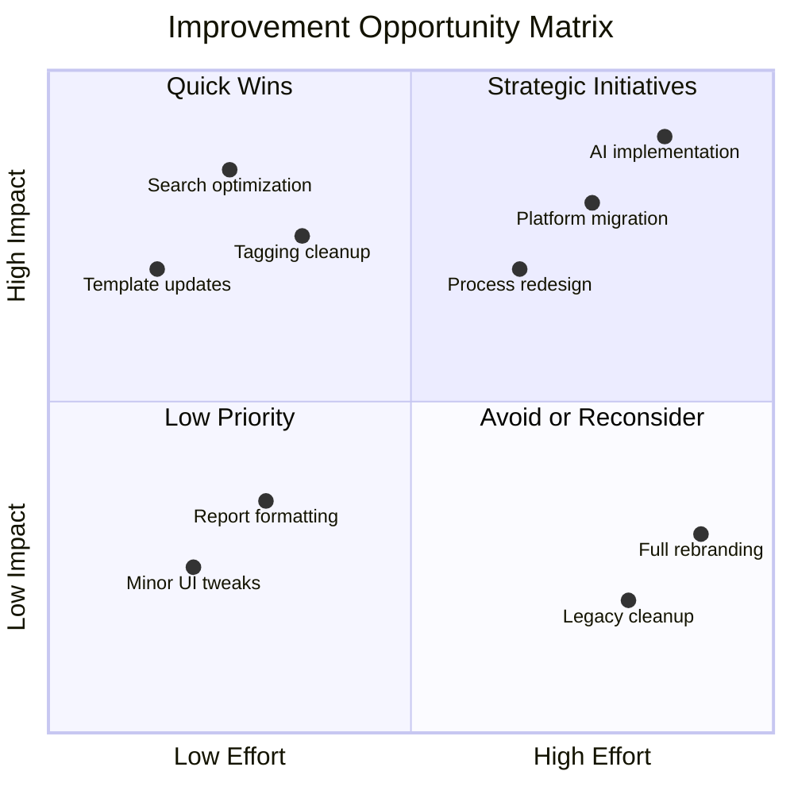

# Chapter 17: Continual Improvement through Knowledge

## Learning Objectives

After completing this chapter, you will be able to:

- Use knowledge analytics to identify service improvement opportunities
- Design and implement knowledge feedback loops for continuous learning
- Apply trend analysis to predict and prevent service issues
- Create knowledge-driven improvement programs aligned with ITIL Continual Improvement
- Leverage knowledge metrics to demonstrate and enhance organizational value
- Integrate knowledge management with broader service improvement initiatives
- Build a culture of continuous learning and knowledge-driven innovation

---

## 17.1 Introduction to Knowledge-Driven Improvement

### The Knowledge-Improvement Connection

Knowledge management and continual improvement form a powerful symbiotic relationship where each reinforces and amplifies the other.

**Knowledge Enables Improvement**
- Captures lessons learned from past improvements
- Provides data for identifying improvement opportunities
- Documents best practices for replication
- Preserves organizational learning over time

**Improvement Enhances Knowledge**
- Creates new knowledge through experimentation
- Validates and updates existing knowledge
- Identifies knowledge gaps requiring attention
- Demonstrates knowledge value and ROI

### ITIL 4 Continual Improvement Model and Knowledge

```
┌──────────────────────────────────────────────────────────────┐
│         ITIL 4 CONTINUAL IMPROVEMENT MODEL                   │
│              (Knowledge Integration)                         │
└────────────────────────┬─────────────────────────────────────┘
                         │
                         ▼
              ┌──────────────────┐
              │ What is the      │
              │ Vision?          │───► Knowledge: Strategic goals, success criteria
              └────────┬─────────┘
                       │
                       ▼
              ┌──────────────────┐
              │ Where are we     │
              │ Now?             │───► Knowledge: Current state, metrics, gaps
              └────────┬─────────┘
                       │
                       ▼
              ┌──────────────────┐
              │ Where do we      │
              │ Want to Be?      │───► Knowledge: Target state, benchmarks
              └────────┬─────────┘
                       │
                       ▼
              ┌──────────────────┐
              │ How do we        │
              │ Get There?       │───► Knowledge: Improvement methods, plans
              └────────┬─────────┘
                       │
                       ▼
              ┌──────────────────┐
              │ Take Action      │───► Knowledge: Implementation guides, procedures
              └────────┬─────────┘
                       │
                       ▼
              ┌──────────────────┐
              │ Did we           │
              │ Get There?       │───► Knowledge: Results, lessons learned
              └────────┬─────────┘
                       │
                       ▼
              ┌──────────────────┐
              │ How do we        │
              │ Keep the         │───► Knowledge: Reinforcement, monitoring
              │ Momentum?        │
              └──────────────────┘
                       │
                       │ (Loop back to "What is the Vision?")
                       └────────────────────┐
                                           │
                                           ▼
                              ┌────────────────────┐
                              │ KNOWLEDGE BASE     │
                              │ Updated with       │
                              │ Improvement        │
                              │ Insights           │
                              └────────────────────┘
```

### Types of Knowledge-Driven Improvements

| Improvement Type | Knowledge Source | Expected Outcome |
|------------------|------------------|------------------|
| **Reactive** | Incident patterns, problem trends | Reduce recurring issues |
| **Proactive** | Trend analysis, predictive insights | Prevent potential issues |
| **Process** | Usage patterns, workflow bottlenecks | Increase efficiency |
| **Quality** | Feedback ratings, content health metrics | Enhance knowledge effectiveness |
| **Innovation** | Gap analysis, user suggestions | New capabilities or approaches |
| **Strategic** | Value metrics, benchmarking | Align with organizational goals |

---

## 17.2 Knowledge Analytics for Improvement

### Analytics Framework

**Multi-Dimensional Analysis Approach**

```
┌──────────────────────────────────────────────────────────────┐
│              KNOWLEDGE ANALYTICS FRAMEWORK                   │
├──────────────────────────────────────────────────────────────┤
│                                                              │
│  ┌─────────────┐    ┌─────────────┐    ┌─────────────┐    │
│  │ DESCRIPTIVE │    │ DIAGNOSTIC  │    │ PREDICTIVE  │    │
│  │ ANALYTICS   │───►│ ANALYTICS   │───►│ ANALYTICS   │    │
│  │             │    │             │    │             │    │
│  │ What         │    │ Why did it  │    │ What will   │    │
│  │ happened?   │    │ happen?     │    │ happen?     │    │
│  └─────────────┘    └─────────────┘    └─────────────┘    │
│         │                   │                   │           │
│         └───────────────────┼───────────────────┘           │
│                             │                               │
│                             ▼                               │
│                    ┌─────────────┐                         │
│                    │PRESCRIPTIVE │                         │
│                    │ ANALYTICS   │                         │
│                    │             │                         │
│                    │ What should │                         │
│                    │ we do?      │                         │
│                    └─────────────┘                         │
│                             │                               │
│                             ▼                               │
│                    ┌─────────────┐                         │
│                    │ IMPROVEMENT │                         │
│                    │ ACTIONS     │                         │
│                    └─────────────┘                         │
└──────────────────────────────────────────────────────────────┘
```

### Key Analytics Categories

#### Usage Analytics

**What to Measure**

| Metric | Purpose | Improvement Insight |
|--------|---------|---------------------|
| **Article Views** | Identify popular topics | High-demand areas need quality investment |
| **Search Patterns** | Understand user needs | Common searches reveal priority topics |
| **Zero-Result Searches** | Find knowledge gaps | Missing content opportunities |
| **Article Age vs. Usage** | Assess content lifecycle | Older, unused content candidates for archival |
| **Peak Usage Times** | Understand access patterns | Capacity planning, availability requirements |
| **Device/Platform Analytics** | User access methods | Optimize for mobile, specific tools |

**Example Usage Analysis Report**

```
┌─────────────────────────────────────────────────────────────┐
│          MONTHLY USAGE ANALYTICS REPORT                     │
│                 October 2025                                 │
├─────────────────────────────────────────────────────────────┤
│                                                             │
│  Top 10 Most Viewed Articles                               │
│  ├─ 1. Password Reset Procedures (2,847 views)            │
│  ├─ 2. VPN Connection Troubleshooting (1,923 views)       │
│  ├─ 3. Email Configuration Guide (1,654 views)            │
│  ├─ 4. Software Installation Requests (1,432 views)       │
│  ├─ 5. Multi-Factor Authentication Setup (1,289 views)    │
│  └─ ... [remaining 5 articles]                            │
│                                                             │
│  Top 10 Search Terms (No Results)                          │
│  ├─ 1. "wi-fi keeps disconnecting" (87 searches)          │
│  ├─ 2. "slow computer startup" (64 searches)              │
│  ├─ 3. "printer offline error" (52 searches)              │
│  ├─ 4. "teams camera not working" (47 searches)           │
│  ├─ 5. "shared drive access" (43 searches)                │
│  └─ ... [remaining 5 terms]                               │
│                                                             │
│  IMPROVEMENT ACTIONS RECOMMENDED:                           │
│  1. Create articles for top 5 zero-result searches         │
│  2. Enhance top articles with multimedia (screenshots)     │
│  3. Review synonym coverage for common terms               │
│  4. Optimize mobile experience (45% mobile access)         │
└─────────────────────────────────────────────────────────────┘
```

#### Quality Analytics

**Quality Measurement Framework**

| Dimension | Metrics | Target | Data Source |
|-----------|---------|--------|-------------|
| **User Satisfaction** | Average rating, thumbs up/down ratio | >4.0/5.0, >80% positive | Feedback system |
| **Effectiveness** | Resolution rate from article use | >75% | Ticket disposition |
| **Accuracy** | Error reports, corrections needed | <5% flagged | Flag tracking |
| **Completeness** | Template field completion | 100% required fields | Content audit |
| **Clarity** | Readability scores, clarification requests | Grade 8-10 level, <5% requests | Readability tools, feedback |
| **Findability** | Click-through rate from search | >70% | Search analytics |

#### Performance Analytics

**Service Delivery Impact Metrics**

```
┌─────────────────────────────────────────────────────────────┐
│        KNOWLEDGE IMPACT ON SERVICE PERFORMANCE              │
├─────────────────────────────────────────────────────────────┤
│                                                             │
│  Incident Resolution Performance                            │
│  ┌─────────────────────────────────────────────────────┐  │
│  │                                                     │  │
│  │  With Knowledge Use:                                │  │
│  │  ├─ Average Resolution Time: 12 minutes            │  │
│  │  ├─ First Contact Resolution: 78%                  │  │
│  │  └─ User Satisfaction: 4.5/5.0                     │  │
│  │                                                     │  │
│  │  Without Knowledge Use:                             │  │
│  │  ├─ Average Resolution Time: 28 minutes            │  │
│  │  ├─ First Contact Resolution: 42%                  │  │
│  │  └─ User Satisfaction: 3.8/5.0                     │  │
│  │                                                     │  │
│  │  IMPROVEMENT: 57% faster, 86% better FCR           │  │
│  └─────────────────────────────────────────────────────┘  │
│                                                             │
│  Self-Service Performance                                   │
│  ┌─────────────────────────────────────────────────────┐  │
│  │  Success Rate: 47% (target: 50%)                   │  │
│  │  Avg. Time to Resolution: 4.2 minutes              │  │
│  │  Tickets Deflected: 1,847/month                    │  │
│  │  Deflection Value: $27,705/month (assumed)         │  │
│  └─────────────────────────────────────────────────────┘  │
│                                                             │
│  Agent Productivity                                         │
│  ┌─────────────────────────────────────────────────────┐  │
│  │  Tickets per Agent per Day: 32 (was 24)            │  │
│  │  Research Time Saved: 6.3 hours/agent/week         │  │
│  │  Knowledge Reuse Rate: 68% of tickets              │  │
│  └─────────────────────────────────────────────────────┘  │
└─────────────────────────────────────────────────────────────┘
```

### Analytical Tools and Techniques

**Essential Analytics Tools**

| Tool Type | Purpose | Example Tools |
|-----------|---------|---------------|
| **BI/Reporting Platforms** | Dashboards, reports, visualizations | Power BI, Tableau, Qlik |
| **Search Analytics** | Query analysis, findability assessment | Built-in ITSM tools, Google Analytics |
| **Text Analytics** | Content analysis, sentiment analysis | Natural language processing tools |
| **Predictive Analytics** | Trend forecasting, anomaly detection | Machine learning platforms |
| **Heat Mapping** | User interaction patterns | User experience tools |
| **A/B Testing** | Content optimization experiments | Optimization platforms |

---

## 17.3 Feedback Loops and Continuous Learning

### Feedback Loop Architecture

```
┌──────────────────────────────────────────────────────────────┐
│              KNOWLEDGE FEEDBACK ECOSYSTEM                    │
└────────────────────────┬─────────────────────────────────────┘
                         │
         ┌───────────────┴───────────────┐
         │                               │
         ▼                               ▼
┌────────────────┐              ┌────────────────┐
│ EXPLICIT       │              │ IMPLICIT       │
│ FEEDBACK       │              │ FEEDBACK       │
├────────────────┤              ├────────────────┤
│ • Ratings      │              │ • Usage data   │
│ • Comments     │              │ • Search terms │
│ • Flags        │              │ • Time on page │
│ • Surveys      │              │ • Navigation   │
└───────┬────────┘              └────────┬───────┘
        │                               │
        └───────────────┬───────────────┘
                        │
                        ▼
              ┌──────────────────┐
              │ FEEDBACK         │
              │ AGGREGATION &    │
              │ ANALYSIS         │
              └────────┬─────────┘
                       │
         ┌─────────────┼─────────────┐
         │             │             │
         ▼             ▼             ▼
┌────────────┐  ┌──────────┐  ┌──────────┐
│ CONTENT    │  │ PROCESS  │  │ STRATEGY │
│ UPDATES    │  │ IMPROVE  │  │ ADJUST   │
└─────┬──────┘  └────┬─────┘  └────┬─────┘
      │              │             │
      └──────────────┴─────────────┘
                     │
                     ▼
           ┌──────────────────┐
           │ COMMUNICATE      │
           │ CHANGES          │
           └────────┬─────────┘
                    │
                    ▼
           ┌──────────────────┐
           │ MONITOR IMPACT   │
           └────────┬─────────┘
                    │
                    │ (Loop continues)
                    └────────────────────┐
                                        │
                                        ▼
                              ┌──────────────────┐
                              │ ORGANIZATIONAL   │
                              │ LEARNING         │
                              └──────────────────┘
```

### Types of Feedback Mechanisms

#### Explicit Feedback

**Rating Systems**
- 5-star ratings for article quality
- Thumbs up/thumbs down for quick feedback
- Net Promoter Score (NPS) for knowledge service
- Detailed surveys for in-depth assessment

**Comment Systems**
- Open-text feedback on articles
- Suggestion boxes for improvements
- Correction submissions for errors
- Feature requests for knowledge tools

**Flag and Report Functions**
- Flag outdated content
- Report inaccuracies
- Identify duplicates
- Request additional information

#### Implicit Feedback

**Behavioral Analytics**

| Signal | What It Indicates | Response |
|--------|-------------------|----------|
| **High views, low time-on-page** | Content not meeting needs | Review and enhance article |
| **High search frequency, low article clicks** | Poor search relevance | Improve metadata, keywords |
| **Article viewed but ticket still created** | Article didn't solve issue | Verify solution accuracy |
| **Repeated article updates** | Content instability | Subject matter expert review |
| **High bounce rate** | Poor first impression | Improve article structure, title |
| **Navigation patterns** | User information seeking behavior | Optimize related article links |

### Feedback Processing Workflow

**From Feedback to Action**

| Stage | Activities | Responsibility | Timeframe |
|-------|------------|----------------|-----------|
| **Capture** | Collect feedback from all sources | Automated systems | Real-time |
| **Triage** | Categorize and prioritize feedback | KCS analysts | Daily |
| **Analysis** | Identify patterns and root causes | KCS analysts + coaches | Weekly |
| **Action Planning** | Decide on improvements | Knowledge team + SMEs | Weekly |
| **Implementation** | Execute improvements | Content owners | Varies |
| **Communication** | Inform stakeholders of changes | KCS coaches | After changes |
| **Verification** | Confirm improvement effectiveness | KCS analysts | 30 days post-change |

---

## 17.4 Trend Analysis and Predictive Insights

### Trend Analysis Framework

**Temporal Trend Analysis**

| Trend Type | Analysis Focus | Improvement Application |
|------------|----------------|-------------------------|
| **Seasonal Patterns** | Cyclical issues (e.g., password resets after vacations) | Pre-emptive content updates, staffing |
| **Growth Trends** | Increasing incident volumes for specific topics | Capacity planning, root cause investigation |
| **Decline Trends** | Decreasing incidents (improvement indicator) | Validate success, reallocate resources |
| **Anomalies** | Sudden spikes or drops | Incident detection, change impact analysis |
| **Day-of-Week/Time-of-Day** | When issues occur | Self-service optimization, shift planning |

**Example Trend Analysis Dashboard**

```
┌─────────────────────────────────────────────────────────────┐
│           QUARTERLY TREND ANALYSIS REPORT                   │
│                    Q4 2025                                   │
├─────────────────────────────────────────────────────────────┤
│                                                             │
│  Emerging Issue Trends (Growing >50% QoQ)                  │
│  ┌─────────────────────────────────────────────────────┐  │
│  │ 1. Microsoft Teams Performance Issues               │  │
│  │    ├─ Q3: 89 incidents                              │  │
│  │    ├─ Q4: 167 incidents (+88%)                      │  │
│  │    └─ Action: Escalate to problem management       │  │
│  │                                                     │  │
│  │ 2. Cloud Storage Sync Errors                        │  │
│  │    ├─ Q3: 134 incidents                             │  │
│  │    ├─ Q4: 215 incidents (+60%)                      │  │
│  │    └─ Action: Create comprehensive KB article      │  │
│  │                                                     │  │
│  │ 3. Password Complexity Requirement Questions        │  │
│  │    ├─ Q3: 67 incidents                              │  │
│  │    ├─ Q4: 118 incidents (+76%)                      │  │
│  │    └─ Action: Enhance self-service content         │  │
│  └─────────────────────────────────────────────────────┘  │
│                                                             │
│  Declining Issue Trends (Decrease >40% QoQ)                │
│  ┌─────────────────────────────────────────────────────┐  │
│  │ 1. Email Configuration Issues                       │  │
│  │    ├─ Q3: 234 incidents                             │  │
│  │    ├─ Q4: 87 incidents (-63%)                       │  │
│  │    └─ Success: New KB article + training effective │  │
│  │                                                     │  │
│  │ 2. VPN Connection Problems                          │  │
│  │    ├─ Q3: 412 incidents                             │  │
│  │    ├─ Q4: 198 incidents (-52%)                      │  │
│  │    └─ Success: Infrastructure upgrade + KB update  │  │
│  └─────────────────────────────────────────────────────┘  │
│                                                             │
│  Seasonal Patterns Identified                               │
│  • December: +34% password reset requests (returning      │
│    from holiday)                                           │
│  • Early October: +28% software access requests (new      │
│    academic year/fiscal year)                              │
│  • Fridays 4-6pm: +45% ticket volume (week-end rush)     │
└─────────────────────────────────────────────────────────────┘
```

### Predictive Analytics Applications

**Proactive Improvement Opportunities**

| Prediction Type | Data Sources | Preventive Action |
|-----------------|--------------|-------------------|
| **Incident Volume Forecasting** | Historical volumes, seasonal factors, change calendar | Capacity planning, pre-positioned knowledge |
| **Emerging Problem Identification** | Incident clustering, pattern recognition | Early problem records, preventive fixes |
| **Knowledge Gap Prediction** | Technology roadmap, upcoming changes | Pre-create knowledge, training planning |
| **Content Decay Detection** | Usage decline, age, related system changes | Schedule reviews, flag for updates |
| **User Behavior Modeling** | Access patterns, query evolution | Personalize knowledge delivery |

### Pattern Recognition for Root Cause

**Connecting Dots Across Data**

```
┌──────────────────────────────────────────────────────────────┐
│         PATTERN ANALYSIS FOR ROOT CAUSE DISCOVERY            │
└────────────────────────┬─────────────────────────────────────┘
                         │
              ┌──────────┴──────────┐
              │ DATA COLLECTION     │
              └──────────┬──────────┘
                         │
    ┌────────────────────┼────────────────────┐
    │                    │                    │
    ▼                    ▼                    ▼
┌────────┐         ┌─────────┐         ┌─────────┐
│INCIDENT│         │ CHANGE  │         │ CMDB    │
│ DATA   │         │ RECORDS │         │ DATA    │
└───┬────┘         └────┬────┘         └────┬────┘
    │                   │                   │
    └───────────────────┼───────────────────┘
                        │
                        ▼
              ┌──────────────────┐
              │ CORRELATION      │
              │ ANALYSIS         │
              └────────┬─────────┘
                       │
              ┌────────┴────────┐
              │                 │
              ▼                 ▼
       ┌─────────┐       ┌──────────┐
       │ TEMPORAL│       │COMPONENT │
       │ PATTERNS│       │PATTERNS  │
       └────┬────┘       └─────┬────┘
            │                  │
            └────────┬─────────┘
                     │
                     ▼
            ┌─────────────────┐
            │ ROOT CAUSE      │
            │ HYPOTHESIS      │
            └────────┬────────┘
                     │
                     ▼
            ┌─────────────────┐
            │ KNOWLEDGE       │
            │ CREATION        │
            │ (Prevention)    │
            └─────────────────┘
```

---

## 17.5 Knowledge-Driven Improvement Programs

### Improvement Program Structure

**Program Components**

| Component | Description | Key Activities |
|-----------|-------------|----------------|
| **Improvement Register** | Catalog of identified opportunities | Log, prioritize, track improvements |
| **Working Groups** | Cross-functional improvement teams | Analyze, design, implement solutions |
| **Experimentation Framework** | Safe environment for testing ideas | Pilots, A/B tests, controlled rollouts |
| **Measurement System** | Track improvement outcomes | Baseline, monitor, assess impact |
| **Knowledge Repository** | Central improvement knowledge | Methods, results, lessons learned |
| **Communication Plan** | Share improvements and results | Reports, presentations, celebrations |

### Improvement Initiatives Sourced from Knowledge

**Knowledge Gap Analysis Program**

```markdown
## Knowledge Gap Analysis - Monthly Cycle

### Phase 1: Identify Gaps (Week 1)
- Review zero-result searches
- Analyze unlinked ticket resolutions
- Collect user and agent requests
- Review new technology implementations

### Phase 2: Prioritize (Week 2)
- Assess business impact of each gap
- Evaluate effort required to fill gap
- Prioritize using impact/effort matrix
- Assign owners for top 10 gaps

### Phase 3: Create Content (Weeks 2-3)
- Develop articles for priority gaps
- Engage subject matter experts
- Review and refine content
- Publish to knowledge base

### Phase 4: Measure Impact (Week 4)
- Track usage of new articles
- Monitor related incident volumes
- Collect user feedback
- Report results to stakeholders

### Outcomes (Example)
- 15 knowledge gaps identified
- 10 new articles created
- 3 existing articles enhanced
- 23% reduction in incidents for covered topics
- 1,234 article views in first month
```

**Process Improvement from Knowledge Patterns**

| Knowledge Pattern | Insight | Process Improvement |
|-------------------|---------|---------------------|
| Frequent article updates | Content instability | Implement validation process before publishing |
| High search, low click-through | Poor relevance | Enhance search algorithm, improve metadata |
| Articles viewed but low ratings | Quality issues | Establish peer review, template improvements |
| Long articles rarely completed | User attention span | Implement progressive disclosure, video alternatives |
| Similar articles by different authors | Lack of coordination | Centralize content ownership by topic |

### Service Innovation Through Knowledge

**Innovation Pipeline**

```
┌──────────────────────────────────────────────────────────────┐
│              KNOWLEDGE-DRIVEN INNOVATION PIPELINE            │
└────────────────────────┬─────────────────────────────────────┘
                         │
              ┌──────────┴──────────┐
              │ 1. IDEA CAPTURE     │
              │ • User suggestions  │
              │ • Agent insights    │
              │ • Trend analysis    │
              └──────────┬──────────┘
                         │
              ┌──────────┴──────────┐
              │ 2. EVALUATION       │
              │ • Feasibility       │
              │ • Value potential   │
              │ • Resource needs    │
              └──────────┬──────────┘
                         │
                  ┌──────┴───────┐
                  │ GO / NO GO   │
                  └──────┬───────┘
                         │ GO
                         ▼
              ┌──────────────────┐
              │ 3. EXPERIMENT    │
              │ • Prototype      │
              │ • Pilot test     │
              │ • Gather data    │
              └────────┬─────────┘
                       │
                       ▼
              ┌──────────────────┐
              │ 4. EVALUATE      │
              │ • Assess results │
              │ • Refine concept │
              └────────┬─────────┘
                       │
              ┌────────┴────────┐
              │ SUCCESS? YES/NO │
              └────────┬────────┘
                       │ YES
                       ▼
              ┌──────────────────┐
              │ 5. SCALE         │
              │ • Full rollout   │
              │ • Documentation  │
              │ • Training       │
              └────────┬─────────┘
                       │
                       ▼
              ┌──────────────────┐
              │ 6. EMBED         │
              │ • Standard       │
              │   practice       │
              │ • Knowledge      │
              │   capture        │
              └──────────────────┘
```

**Innovation Examples**

| Innovation | Knowledge Driver | Impact |
|------------|------------------|--------|
| **AI-Powered Article Suggestions** | Analysis of search-to-resolution patterns | 35% reduction in agent search time |
| **Chatbot for Common Issues** | Top 20 high-volume, standard-resolution incidents | 1,200 tickets/month deflected |
| **Personalized Knowledge Dashboard** | User role and history analysis | 28% increase in self-service success |
| **Automated Known Error Detection** | Pattern recognition in incident clustering | 40% faster problem identification |
| **Video Micro-Learning Library** | Preference data showing engagement with visual content | 45% improvement in article effectiveness |

---

## 17.6 Knowledge Value Demonstration

### Value Measurement Framework

**Balanced Scorecard for Knowledge Management**

```
┌─────────────────────────────────────────────────────────────┐
│    KNOWLEDGE MANAGEMENT BALANCED SCORECARD (EXAMPLE)        │
├─────────────────────────────────────────────────────────────┤
│  Note: All financial values are illustrative examples.      │
│                                                             │
│  FINANCIAL PERSPECTIVE (Example Values)                     │
│  ├─ Cost Avoidance: $487,000/year                          │
│  ├─ Efficiency Gains: $234,000/year                        │
│  ├─ Investment: $185,000/year                              │
│  └─ Net Value: $536,000/year (ROI: 190%)                   │
│                                                             │
│  CUSTOMER PERSPECTIVE                                       │
│  ├─ User Satisfaction: 4.3/5.0 (target: 4.0)              │
│  ├─ Self-Service Success: 49% (target: 45%)               │
│  ├─ First Contact Resolution: 74% (target: 70%)           │
│  └─ Incident Resolution Time: -42% vs. baseline           │
│                                                             │
│  INTERNAL PROCESS PERSPECTIVE                               │
│  ├─ Knowledge Reuse Rate: 71% (target: 65%)               │
│  ├─ Article Quality Score: 4.2/5.0 (target: 4.0)          │
│  ├─ Search Success Rate: 79% (target: 75%)                │
│  └─ Content Health Score: 87% (target: 80%)               │
│                                                             │
│  LEARNING & GROWTH PERSPECTIVE                              │
│  ├─ New Agent Time-to-Productivity: -58% vs. baseline     │
│  ├─ KCS Contributor Licensing: 92% of staff               │
│  ├─ Knowledge Contribution Rate: 3.2 articles/agent/month │
│  └─ Innovation Ideas Implemented: 8/quarter                │
└─────────────────────────────────────────────────────────────┘
```

### Value Communication Strategies

**Executive Reporting**

| Report Type | Frequency | Key Content | Audience |
|-------------|-----------|-------------|----------|
| **Executive Dashboard** | Monthly | KPIs, trends, ROI, highlights | C-suite, senior leadership |
| **Operational Report** | Weekly | Usage, quality, improvement actions | Operations managers |
| **Improvement Report** | Quarterly | Completed improvements, impact, roadmap | Leadership, stakeholders |
| **Annual Business Review** | Yearly | Year in review, strategic achievements, plans | All stakeholders |

**Storytelling with Data**

```markdown
## Example: Executive Summary Template

> **Note:** This is an illustrative example with hypothetical values. Replace all $ figures with your organization's actual data.

### Knowledge Management Impact: Q4 2025 (Example)

**Executive Summary**
In Q4, our knowledge management program delivered $142,000 in measurable
value through incident deflection, faster resolution times, and improved
agent productivity. Self-service success rates reached an all-time high
of 49%, meaning nearly half of our users now solve their own issues
without IT assistance.

**Key Achievements**
• Reduced incident resolution time by 9 minutes on average (32% improvement)
• Deflected 1,847 tickets through self-service, saving $27,705 (assumed rate)
• Launched AI-powered article suggestions, reducing agent search time by 35%
• Achieved 92% KCS contributor licensing across support teams

**Success Story: Password Management**
Challenge: Password reset requests were our #1 ticket category (18% of volume).
Action: Created comprehensive self-service password reset KB article with
video tutorial and enhanced self-service portal.
Result: 63% reduction in password reset tickets, 2-minute average self-service
resolution vs. 8-minute agent-assisted resolution.
Value: $4,200/month savings (example), improved user experience.

**Looking Ahead: Q1 2026**
• Expand chatbot capabilities to top 10 incident categories
• Implement predictive analytics for proactive problem prevention
• Launch knowledge maturity assessment and roadmap to Level 4
```

### Benchmarking and Maturity Assessment

**Knowledge Management Maturity Model**

| Maturity Level | Characteristics | Typical Metrics |
|----------------|-----------------|-----------------|
| **Level 1: Initial** | Ad-hoc, individual efforts | <30% knowledge reuse, no formal processes |
| **Level 2: Developing** | Some structure, inconsistent adoption | 30-50% reuse, basic metrics tracked |
| **Level 3: Defined** | Documented processes, growing adoption | 50-70% reuse, comprehensive metrics |
| **Level 4: Managed** | Integrated, measured, continuous improvement | 70-85% reuse, value demonstrated |
| **Level 5: Optimizing** | Industry-leading, innovation, transformation | >85% reuse, strategic asset |

**Benchmarking Data Sources**
- Industry peer networks (e.g., Consortium for Service Innovation)
- Analyst reports (Gartner, Forrester, HDI)
- User group conferences and forums
- Vendor-provided benchmarks
- Cross-industry knowledge management communities

---

## 17.7 Building a Continuous Learning Culture

### Cultural Elements for Knowledge-Driven Improvement

**Key Cultural Attributes**

| Attribute | Description | Enablers |
|-----------|-------------|----------|
| **Curiosity** | Desire to understand and improve | Encourage questions, reward learning |
| **Transparency** | Open sharing of information and results | Visible metrics, honest communication |
| **Experimentation** | Safe environment to try new approaches | Fail-forward mindset, innovation time |
| **Collaboration** | Cross-functional knowledge sharing | Communities of practice, collaboration tools |
| **Continuous Learning** | Ongoing skill development | Training programs, knowledge sharing sessions |
| **Accountability** | Ownership of knowledge quality | Clear roles, performance expectations |

### Learning Organization Practices

**Knowledge Sharing Mechanisms**

| Mechanism | Purpose | Frequency | Format |
|-----------|---------|-----------|--------|
| **Lessons Learned Sessions** | Capture insights from incidents/projects | After major events | Facilitated workshop |
| **Brown Bag Lunches** | Informal knowledge sharing | Weekly/bi-weekly | Presentation + discussion |
| **Communities of Practice** | Domain expertise development | Monthly meetings | Various |
| **Knowledge Fairs** | Showcase innovations and successes | Quarterly | Exhibition style |
| **Peer Assist Sessions** | Seek input before major initiatives | As needed | Structured dialogue |
| **After Action Reviews** | Reflect on completed work | After projects | Team retrospective |

**Recognition and Rewards**

```markdown
## Knowledge Champion Recognition Program

### Individual Recognition
- **Monthly Knowledge Star**: Top contributor (articles created/updated)
- **Quality Award**: Highest-rated articles
- **Innovation Award**: Creative knowledge solution
- **Mentor Award**: Exceptional coaching and knowledge transfer

### Team Recognition
- **Best Practice Sharing**: Team presenting improvement at all-hands
- **Knowledge Excellence**: Team with highest content health score
- **Customer Impact**: Team improvement with greatest user satisfaction increase

### Rewards
- Public recognition at team meetings
- Feature in internal newsletter
- Certificates and badges
- Performance review notation
- Professional development opportunities
- Gift cards or company swag

### Annual Awards
- Knowledge Management Champion of the Year
- Innovation Team of the Year
- Presented at annual leadership meeting
- Trophy + significant reward (bonus, extra PTO, conference attendance)
```

### Leadership's Role in Improvement Culture

**Leadership Behaviors that Drive Improvement**

| Behavior | Impact | Example Action |
|----------|--------|----------------|
| **Model the way** | Leaders demonstrate expected behaviors | Executive uses knowledge base, shares articles |
| **Allocate resources** | Demonstrates commitment and priority | Budget for KM tools, dedicated staff time |
| **Remove barriers** | Enables adoption and improvement | Simplify publishing process, provide training |
| **Celebrate success** | Reinforces desired behaviors | Public recognition, success story sharing |
| **Accept failure** | Encourages experimentation | Treat failed experiments as learning opportunities |
| **Ask questions** | Promotes inquiry and learning | "What did we learn?" vs. "Who's to blame?" |
| **Share power** | Distributes ownership | Empower teams to make knowledge decisions |

---

## 17.8 Integration with Broader Improvement Initiatives

### Connecting Knowledge to Organizational Initiatives

**Knowledge Management Integration Points**

| Initiative Type | Knowledge Contribution | Integration Approach |
|-----------------|------------------------|----------------------|
| **Digital Transformation** | Documented processes, change knowledge | KM as enabler for transformation |
| **Customer Experience** | Self-service content, faster resolutions | Knowledge improves customer interactions |
| **Operational Excellence** | Process documentation, best practices | Knowledge reduces waste, variability |
| **Agile/DevOps** | Deployment knowledge, runbooks | Continuous knowledge updates in sprints |
| **Change Management** | Lessons learned, change impact knowledge | Knowledge informs change approach |
| **Risk Management** | Known errors, vulnerability documentation | Knowledge identifies and mitigates risks |

### Knowledge in Project and Program Management

**Project Knowledge Lifecycle**

```
┌──────────────────────────────────────────────────────────────┐
│            PROJECT KNOWLEDGE LIFECYCLE                       │
└────────────────────────┬─────────────────────────────────────┘
                         │
              ┌──────────┴──────────┐
              │ INITIATION          │
              │ • Charter           │
              │ • Stakeholder info  │
              │ • Similar projects  │
              └──────────┬──────────┘
                         │
              ┌──────────┴──────────┐
              │ PLANNING            │
              │ • Best practices    │
              │ • Templates         │
              │ • Lessons learned   │
              └──────────┬──────────┘
                         │
              ┌──────────┴──────────┐
              │ EXECUTION           │
              │ • Procedures        │
              │ • Issue resolutions │
              │ • Decision log      │
              └──────────┬──────────┘
                         │
              ┌──────────┴──────────┐
              │ MONITORING          │
              │ • Status reports    │
              │ • Change logs       │
              │ • Risk register     │
              └──────────┬──────────┘
                         │
              ┌──────────┴──────────┐
              │ CLOSING             │
              │ • Final docs        │
              │ • Lessons learned   │
              │ • Archive           │
              └──────────┬──────────┘
                         │
                         ▼
              ┌──────────────────────┐
              │ ORGANIZATIONAL       │
              │ KNOWLEDGE BASE       │
              │ (For future projects)│
              └──────────────────────┘
```

### Strategic Alignment

**Ensuring Knowledge Supports Business Strategy**

| Strategic Goal | Knowledge Enabler | Success Indicator |
|----------------|-------------------|-------------------|
| **Improve customer satisfaction** | Self-service knowledge, faster resolutions | CSAT scores increase |
| **Reduce operational costs** | Knowledge reuse, efficiency gains | Cost per ticket decreases |
| **Scale without proportional headcount** | Comprehensive knowledge base | Tickets per agent increases |
| **Enter new markets** | Market-specific knowledge | Speed to market improves |
| **Improve service quality** | Best practice documentation | Defect rates decrease |
| **Enhance innovation** | Idea capture, experimentation knowledge | Innovation pipeline grows |

---

## 17.9 KM Improvement Framework

### PDCA Cycle for Knowledge Management

The Plan-Do-Check-Act (PDCA) cycle, also known as the Deming Cycle, provides a systematic framework for continuous improvement in knowledge management. When applied to KM, it creates a structured approach for identifying opportunities, implementing changes, measuring results, and standardizing successful improvements.

```
┌──────────────────────────────────────────────────────────────┐
│         PDCA CYCLE FOR KNOWLEDGE MANAGEMENT                  │
└────────────────────────┬─────────────────────────────────────┘
                         │
           ┌─────────────┴─────────────┐
           │                           │
           ▼                           │
    ┌─────────────┐                   │
    │    PLAN     │                   │
    │             │                   │
    │ • Identify  │                   │
    │   problem   │                   │
    │ • Analyze   │                   │
    │   root      │                   │
    │   cause     │                   │
    │ • Set       │                   │
    │   targets   │                   │
    │ • Design    │                   │
    │   solution  │                   │
    └──────┬──────┘                   │
           │                          │
           ▼                          │
    ┌─────────────┐                   │
    │     DO      │                   │
    │             │                   │
    │ • Test      │                   │
    │   solution  │                   │
    │ • Implement │                   │
    │   on small  │                   │
    │   scale     │                   │
    │ • Collect   │                   │
    │   data      │                   │
    └──────┬──────┘                   │
           │                          │
           ▼                          │
    ┌─────────────┐                   │
    │   CHECK     │                   │
    │             │                   │
    │ • Compare   │                   │
    │   results   │                   │
    │   vs target │                   │
    │ • Analyze   │                   │
    │   variance  │                   │
    │ • Document  │                   │
    │   findings  │                   │
    └──────┬──────┘                   │
           │                          │
           ▼                          │
    ┌─────────────┐                   │
    │     ACT     │                   │
    │             │                   │
    │ • Standard- │                   │
    │   ize if    │                   │
    │   success   │                   │
    │ • Adjust if │                   │
    │   needed    │                   │
    │ • Document  │                   │
    │   lessons   │                   │
    └──────┬──────┘                   │
           │                          │
           └──────────────────────────┘
                  (Cycle continues)
```

**PDCA Application Example: Improving Search Success Rate**

| Phase | Activities | Duration | Outcomes |
|-------|-----------|----------|----------|
| **Plan** | Analyzed search logs, identified 35% failed searches due to synonym mismatch; set target of 85% success rate; designed synonym expansion and metadata enhancement program | 2 weeks | Implementation plan, resource allocation, success metrics |
| **Do** | Pilot with top 50 high-volume search terms; added 200+ synonyms, enhanced metadata for 150 articles; trained 5 content owners on new metadata standards | 3 weeks | Pilot implementation, training completion, updated articles |
| **Check** | Monitored search success rate over 4 weeks; achieved 78% success (up from 65%, toward 85% target); collected user feedback; analyzed remaining failure patterns | 4 weeks | Performance data, user feedback, variance analysis |
| **Act** | Standardized synonym process across all content areas; created metadata guidelines; expanded to all articles; scheduled quarterly synonym reviews | 2 weeks | New standard process, documentation, ongoing improvement plan |

### Improvement Identification Methods

**Systematic Approach to Finding Opportunities**

| Method | Description | Frequency | Data Sources | Output |
|--------|-------------|-----------|--------------|--------|
| **Gap Analysis** | Compare current state to desired state or benchmarks | Quarterly | KPIs, maturity assessment, user surveys | Priority gap list |
| **Pain Point Mining** | Analyze user complaints and frustration indicators | Monthly | Feedback, support tickets, comments | Pain point register |
| **Value Stream Mapping** | Identify waste and inefficiency in KM processes | Semi-annually | Process observation, workflow data | Process improvement opportunities |
| **Comparative Analysis** | Benchmark against peers and industry leaders | Annually | Industry reports, peer networks | Performance gaps, best practices |
| **Innovation Scanning** | Monitor emerging technologies and practices | Ongoing | Conferences, research, vendor demos | Innovation opportunities |
| **Stakeholder Feedback** | Structured input from users, agents, leaders | Quarterly | Surveys, focus groups, interviews | Stakeholder requirements |

### Improvement Prioritization Framework

**Multi-Criteria Decision Matrix**

Prioritization ensures resources focus on improvements with the greatest impact and feasibility. The following matrix balances multiple factors:

| Improvement Opportunity | Business Impact (1-5) | User Impact (1-5) | Effort Required (1-5, reverse) | Strategic Alignment (1-5) | Total Score | Priority |
|-------------------------|---------------------|------------------|-------------------------------|--------------------------|-------------|----------|
| Implement AI-powered search | 5 | 5 | 2 | 5 | 17 | High |
| Create mobile app | 4 | 5 | 1 | 4 | 14 | High |
| Add video tutorials | 4 | 4 | 3 | 3 | 14 | High |
| Expand chatbot capabilities | 4 | 4 | 3 | 4 | 15 | High |
| Automated content health checks | 3 | 3 | 4 | 3 | 13 | Medium |
| Personalized dashboards | 3 | 4 | 2 | 3 | 12 | Medium |
| Integration with Teams/Slack | 4 | 4 | 3 | 4 | 15 | High |
| Enhanced analytics platform | 3 | 2 | 3 | 4 | 12 | Medium |
| Gamification features | 2 | 3 | 3 | 2 | 10 | Low |
| Advanced taxonomy | 3 | 3 | 2 | 3 | 11 | Medium |

**Scoring Criteria:**
- **Business Impact:** ROI potential, cost savings, efficiency gains (5 = highest)
- **User Impact:** User satisfaction improvement, usability enhancement (5 = highest)
- **Effort Required:** Time, resources, complexity (5 = least effort, easier to implement)
- **Strategic Alignment:** Alignment with organizational goals (5 = perfectly aligned)

**Improvement Opportunity Matrix**



**Quadrant Definitions:**
- **Quick Wins (High Impact, Low Effort):** Prioritize immediately; deliver rapid value
- **Strategic Initiatives (High Impact, High Effort):** Plan carefully; allocate significant resources
- **Low Priority (Low Impact, Low Effort):** Consider if resources available; may delegate
- **Avoid/Reconsider (Low Impact, High Effort):** Generally avoid unless strategic necessity

---

## 17.10 Content Improvement

### Content Quality Review Process

Systematic content reviews ensure knowledge remains accurate, relevant, and valuable. Quality reviews should be multi-dimensional, assessing various aspects of content health.

**Content Review Schedule**

| Review Type | Frequency | Scope | Responsibility | Focus Areas |
|-------------|-----------|-------|----------------|-------------|
| **Automated Health Check** | Daily | All articles | System | Broken links, outdated metadata, missing fields |
| **Usage-Based Review** | Monthly | High-traffic articles (top 10%) | Content owners | Accuracy, completeness, user feedback |
| **Age-Based Review** | Quarterly | Articles >12 months old without updates | Content owners | Relevance, accuracy, currency |
| **Comprehensive Audit** | Annually | All articles | KM team + content owners | Full quality assessment against standards |
| **Triggered Review** | As needed | Affected by system changes, incidents | SMEs | Impact validation, accuracy updates |
| **Random Sampling** | Monthly | 5% random selection | Quality team | Quality control, standard compliance |

**Quality Review Checklist**

```markdown
## Content Quality Review Checklist

### Article Information
- Article ID: _______________
- Title: _______________
- Last Updated: _______________
- Reviewer: _______________
- Review Date: _______________

### Accuracy (Critical)
□ Technical information is correct
□ Procedures produce expected results
□ Screenshots match current system
□ Links are functional and point to correct targets
□ Contact information is current
□ Supported versions are accurate

### Completeness
□ All template sections are populated
□ Prerequisites are identified
□ Step-by-step instructions are complete
□ Expected outcomes are described
□ Troubleshooting guidance is included
□ Related articles are linked

### Clarity
□ Title clearly describes content
□ Language is appropriate for audience
□ Instructions are unambiguous
□ Technical terms are defined
□ Readability score is appropriate (Grade 8-10)
□ Formatting enhances comprehension

### Relevance
□ Content addresses current user needs
□ Article is still applicable
□ Information reflects current environment
□ Priority aligns with actual usage

### Findability
□ Keywords are comprehensive
□ Metadata is accurate and complete
□ Article is properly categorized
□ Tags are relevant and consistent
□ Search ranking is appropriate for importance

### User Feedback
□ Average rating: _____ (Target: ≥4.0/5.0)
□ Recent comments reviewed
□ Flag/error reports addressed
□ Improvement suggestions considered

### Decision
□ APPROVED - No changes needed
□ UPDATE REQUIRED - Specific changes needed (document below)
□ ARCHIVE - No longer relevant
□ CONSOLIDATE - Merge with article # _____

### Action Items
1. _________________________________
2. _________________________________
3. _________________________________

### Follow-up Date: _______________
```

### Gap Analysis and Content Creation

**Knowledge Gap Identification Process**

| Gap Type | Indicators | Discovery Method | Priority Factors |
|----------|-----------|------------------|------------------|
| **Coverage Gaps** | Zero-result searches, unlinked ticket resolutions | Search analytics, ticket analysis | Volume, business impact, user frustration |
| **Depth Gaps** | High bounce rates, low ratings, additional questions | Usage analytics, feedback | Article importance, frequency of use |
| **Quality Gaps** | Error reports, low ratings, negative feedback | Quality metrics, user input | User impact, accuracy concerns |
| **Format Gaps** | Requests for video, requests for printable versions | User feedback, surveys | User preferences, learning styles |
| **Accessibility Gaps** | Mobile usage issues, language requests | Access analytics, feedback | User base demographics, inclusivity |

**Content Creation Prioritization Matrix**

```
┌─────────────────────────────────────────────────────────────┐
│        CONTENT GAP PRIORITY MATRIX (Q4 2025)                │
├─────────────────────────────────────────────────────────────┤
│                                                             │
│  CRITICAL (Create within 1 week)                           │
│  ┌─────────────────────────────────────────────────────┐  │
│  │ 1. Wi-Fi disconnection troubleshooting              │  │
│  │    Impact: 87 failed searches/month                 │  │
│  │    Ticket volume: ~120 incidents/month              │  │
│  │                                                      │  │
│  │ 2. Printer offline error resolution                 │  │
│  │    Impact: 52 failed searches/month                 │  │
│  │    Ticket volume: ~85 incidents/month               │  │
│  └─────────────────────────────────────────────────────┘  │
│                                                             │
│  HIGH (Create within 2-3 weeks)                            │
│  ┌─────────────────────────────────────────────────────┐  │
│  │ 3. Slow computer startup diagnosis                  │  │
│  │ 4. Teams camera troubleshooting                     │  │
│  │ 5. Shared drive access request process              │  │
│  └─────────────────────────────────────────────────────┘  │
│                                                             │
│  MEDIUM (Create within 1 month)                            │
│  ┌─────────────────────────────────────────────────────┐  │
│  │ 6-10. Various lower-volume topics                   │  │
│  └─────────────────────────────────────────────────────┘  │
│                                                             │
│  LOW (Backlog for future consideration)                    │
│  ┌─────────────────────────────────────────────────────┐  │
│  │ 11-20. Edge cases and infrequent requests          │  │
│  └─────────────────────────────────────────────────────┘  │
└─────────────────────────────────────────────────────────────┘
```

### Content Optimization Techniques

**Enhancement Strategies**

| Optimization Type | Purpose | Techniques | Expected Outcome |
|-------------------|---------|-----------|------------------|
| **Structural Optimization** | Improve comprehension | Progressive disclosure, clear headings, logical flow | Higher completion rates, better satisfaction |
| **Search Optimization** | Enhance findability | Keyword expansion, synonym addition, metadata enrichment | Higher click-through rates, better search success |
| **Visual Enhancement** | Increase engagement | Screenshots, diagrams, videos, infographics | Longer time-on-page, improved understanding |
| **Format Diversification** | Address learning styles | Text + video + interactive guides | Broader user appeal, better outcomes |
| **Performance Optimization** | Faster access | Image compression, efficient formatting, mobile optimization | Reduced load times, better mobile experience |
| **Personalization** | Relevance improvement | Role-based views, dynamic content, recommendations | Higher engagement, increased usage |

### Content Archival Strategy

**Archive Decision Framework**

Not all content should remain active indefinitely. Proper archival maintains knowledge base quality and performance.

**Archival Criteria**

| Criterion | Threshold | Measurement Period | Action |
|-----------|-----------|-------------------|--------|
| **Zero Usage** | 0 views | 6 months | Archive unless strategically important |
| **Minimal Usage** | <5 views | 6 months | Review for consolidation or archival |
| **Obsolete Technology** | System decommissioned | N/A | Archive immediately after decommission |
| **Replaced Content** | Superseded by newer article | N/A | Archive with redirect to new article |
| **Historical Only** | Reference value only | N/A | Move to historical archive |
| **Duplicate Content** | Exact or near-duplicate exists | N/A | Consolidate, archive duplicate |

**Archival Process**

```
┌──────────────────────────────────────────────────────────────┐
│              CONTENT ARCHIVAL WORKFLOW                       │
└────────────────────────┬─────────────────────────────────────┘
                         │
              ┌──────────┴──────────┐
              │ 1. IDENTIFY         │
              │ Candidate for       │
              │ archival            │
              └──────────┬──────────┘
                         │
              ┌──────────┴──────────┐
              │ 2. VALIDATE         │
              │ Confirm no active   │
              │ dependencies        │
              └──────────┬──────────┘
                         │
              ┌──────────┴──────────┐
              │ 3. NOTIFY           │
              │ Alert content       │
              │ owner and users     │
              └──────────┬──────────┘
                         │
              ┌──────────┴──────────┐
              │ 4. REDIRECT         │
              │ Create redirects    │
              │ if applicable       │
              └──────────┬──────────┘
                         │
              ┌──────────┴──────────┐
              │ 5. ARCHIVE          │
              │ Move to archive     │
              │ repository          │
              └──────────┬──────────┘
                         │
              ┌──────────┴──────────┐
              │ 6. DOCUMENT         │
              │ Record archival     │
              │ decision and date   │
              └─────────────────────┘
```

---

## 17.11 Process Improvement

### Workflow Optimization

Knowledge management processes must be efficient to encourage adoption and maximize value. Workflow optimization identifies and eliminates friction points in knowledge creation, maintenance, and consumption.

**Process Optimization Checklist**

| Process Area | Optimization Questions | Improvement Indicators |
|--------------|------------------------|------------------------|
| **Content Creation** | • How many steps from idea to published article?<br>• What approvals are required?<br>• Are templates intuitive?<br>• Is training adequate? | • Time to publish<br>• Contribution rate<br>• Quality at first submission<br>• User satisfaction |
| **Content Review** | • Is review process clearly defined?<br>• Are reviewers responsive?<br>• Is feedback constructive?<br>• Are review criteria objective? | • Review cycle time<br>• Revision frequency<br>• Approval rates<br>• Reviewer consistency |
| **Content Search** | • How many searches succeed?<br>• How many clicks to find content?<br>• Are results relevant?<br>• Are filters effective? | • Search success rate<br>• Click-through rate<br>• Time to find<br>• Search abandonment rate |
| **Content Feedback** | • Is feedback mechanism visible?<br>• Is feedback acted upon?<br>• Are users notified of actions?<br>• Is process closed-loop? | • Feedback submission rate<br>• Response time<br>• Action completion rate<br>• User follow-up satisfaction |
| **Content Maintenance** | • Are reviews scheduled automatically?<br>• Is ownership clear?<br>• Are updates timely?<br>• Is version control effective? | • Content health score<br>• Average article age<br>• Update frequency<br>• Outdated content % |

**Process Improvement Example: Streamlining Content Publishing**

**Before Optimization:**
1. Author drafts article in Word (30 min)
2. Submit to manager for review via email (2-day delay)
3. Manager reviews and returns via email (1-day delay)
4. Author makes revisions (20 min)
5. Re-submit to manager (1-day delay)
6. Manager forwards to KM team (1-day delay)
7. KM team formats for knowledge base (45 min)
8. KM team submits for technical review (2-day delay)
9. Technical reviewer approves (1-day delay)
10. KM team publishes (15 min)

**Total Time: 8+ days, 3+ hours of work**

**After Optimization:**
1. Author creates article directly in knowledge base using template (25 min)
2. Author submits for review via workflow (instant)
3. Manager receives notification, reviews inline (same day)
4. Author makes revisions directly (15 min)
5. Auto-routes to technical reviewer (instant)
6. Technical reviewer approves via mobile app (same day)
7. Auto-publishes upon approval (instant)

**Total Time: 1-2 days, 40 minutes of work**

**Improvements: 75% faster, 47% less effort, fewer errors**

### Automation Opportunities

Strategic automation reduces manual effort, improves consistency, and accelerates knowledge processes.

**Automation Opportunity Assessment**

| Process | Current State | Automation Opportunity | Technology | Expected Benefit |
|---------|---------------|------------------------|------------|------------------|
| **Content Health Monitoring** | Manual quarterly reviews | Automated daily scans for broken links, outdated metadata, missing fields | Scripting, KM platform features | 95% reduction in manual effort, early issue detection |
| **Review Reminders** | Manual tracking in spreadsheet | Automated review notifications based on article age or change events | Workflow automation | 100% compliance, zero missed reviews |
| **Duplicate Detection** | Manual occasional checks | AI-powered similarity detection at creation | Natural language processing | Prevent duplicates, suggest consolidation |
| **Metadata Suggestion** | Authors manually enter | AI suggests categories, tags, keywords | Machine learning | Better metadata quality, faster authoring |
| **Knowledge Gaps** | Monthly manual search log review | Real-time gap identification and prioritization | Analytics automation | Continuous improvement, faster response |
| **Publishing Workflow** | Email-based, manual routing | Automated workflow with role-based routing | Workflow engine | 80% faster publishing, full audit trail |
| **Feedback Triage** | Weekly manual review of comments | AI categorization and priority assignment | Natural language processing | Faster response, better prioritization |
| **Performance Reporting** | Monthly manual report creation | Automated dashboards with real-time data | BI platform integration | Real-time insights, 100% time savings |

### Efficiency Gains Measurement

**Process Efficiency Metrics**

| Metric | Definition | Target | Current | Improvement |
|--------|-----------|--------|---------|-------------|
| **Time to Publish** | Average days from draft to published | ≤2 days | 3.2 days | Workflow optimization underway |
| **Articles per Author per Month** | Content creation productivity | ≥3 articles | 2.1 articles | Training and template enhancement needed |
| **Review Cycle Time** | Average days for review and approval | ≤1 day | 1.8 days | Automated reminders implemented |
| **Search to Resolution** | Average time to find and apply knowledge | ≤3 minutes | 4.5 minutes | Search optimization in progress |
| **Ticket to Article Conversion** | % of resolved tickets that generate articles | ≥15% | 11% | KCS adoption focus area |
| **Content Reuse Rate** | % of tickets leveraging existing knowledge | ≥70% | 68% | Approaching target |
| **Self-Service Deflection** | % of users resolving without ticket | ≥50% | 47% | Content gap analysis addressing |

---

## 17.12 Technology Improvement

### Platform Upgrades and Evolution

Knowledge management technology must evolve to meet changing organizational needs and leverage emerging capabilities.

**Technology Roadmap (2026-2028)**

| Quarter | Initiative | Description | Expected Impact |
|---------|-----------|-------------|-----------------|
| **Q1 2026** | AI Search Enhancement | Implement semantic search, natural language query understanding | 30% improvement in search success rate |
| **Q2 2026** | Mobile App Launch | Native mobile application for iOS and Android | 40% increase in mobile engagement |
| **Q3 2026** | Advanced Analytics | Predictive analytics, anomaly detection, trend forecasting | Proactive improvement identification |
| **Q4 2026** | Chatbot Expansion | Expand from 20 to 100+ topics, integrate with Teams | 2,500+ tickets/month deflection |
| **Q1 2027** | Personalization Engine | AI-driven personalized content recommendations | 25% increase in relevant content discovery |
| **Q2 2027** | Augmented Reality Support | AR guides for hardware troubleshooting | Enhanced user experience for complex tasks |
| **Q3 2027** | Voice Interface | Voice-activated knowledge access | Accessibility enhancement, hands-free access |
| **Q4 2027** | Advanced Collaboration | Real-time co-authoring, inline commenting, video integration | 50% reduction in collaboration friction |
| **Q1 2028** | Knowledge Graph | Semantic relationships between content, automatic linking | Improved knowledge discovery |
| **Q2 2028** | Intelligent Automation | Auto-classification, auto-tagging, suggested improvements | 70% reduction in manual maintenance |

### New Capabilities Assessment

**Emerging Technology Evaluation Framework**

| Technology | Maturity | Business Value | Implementation Complexity | Risk Level | Decision |
|------------|----------|----------------|---------------------------|------------|----------|
| **AI-Powered Search** | Mature | High | Medium | Low | Implement Q1 2026 |
| **Natural Language Generation** | Maturing | High | High | Medium | Pilot Q3 2026 |
| **Knowledge Graph** | Mature | Medium | High | Medium | Implement Q1 2028 |
| **Blockchain for Knowledge** | Emerging | Low | High | High | Monitor, defer |
| **AR/VR Support Guides** | Maturing | Medium | High | Medium | Implement Q2 2027 |
| **Quantum Search** | Nascent | Unknown | Very High | High | Monitor only |
| **Emotion AI for Feedback** | Emerging | Low | Medium | Medium | Monitor, defer |
| **Voice Interfaces** | Mature | Medium | Medium | Low | Implement Q3 2027 |

**Technology Selection Criteria:**
- **Business Value:** ROI potential, user benefit, strategic alignment
- **Maturity:** Proven track record, vendor stability, reference customers
- **Complexity:** Implementation effort, change management requirements
- **Risk:** Technical risk, vendor risk, adoption risk
- **Cost:** Total cost of ownership, ongoing maintenance

### Integration Enhancements

Knowledge management systems increase value through integration with broader IT ecosystem.

**Integration Priority Matrix**

| System | Integration Type | Business Value | Status | Target Completion |
|--------|------------------|----------------|--------|-------------------|
| **ITSM Platform** | Bi-directional | Critical | Complete | Ongoing enhancement |
| **Microsoft Teams** | Embedded search/articles | High | In Progress | Q1 2026 |
| **Slack** | Bot + search | High | Planned | Q2 2026 |
| **SharePoint** | Content sync | Medium | Planned | Q3 2026 |
| **Learning Management System** | Training content link | Medium | Complete | Maintenance mode |
| **CMDB** | Asset-knowledge linking | High | Planned | Q2 2026 |
| **Monitoring Tools** | Incident-knowledge auto-link | High | Planned | Q4 2026 |
| **HR Systems** | Role-based access | Medium | Complete | Maintenance mode |
| **Email** | Knowledge suggestions | Medium | Planned | Q3 2027 |
| **CRM** | Customer-facing knowledge | High | Planned | Q1 2027 |

**Integration Benefits Example: ITSM-Knowledge Deep Integration**

```
┌─────────────────────────────────────────────────────────────┐
│        ITSM-KNOWLEDGE INTEGRATION ARCHITECTURE              │
├─────────────────────────────────────────────────────────────┤
│                                                             │
│  ┌───────────────┐         ┌───────────────┐              │
│  │   INCIDENT    │◄───────►│   KNOWLEDGE   │              │
│  │   MANAGEMENT  │         │     BASE      │              │
│  └───────┬───────┘         └───────┬───────┘              │
│          │                         │                       │
│  ┌───────┴───────────────┬─────────┴───────┐             │
│  │                       │                 │              │
│  ▼                       ▼                 ▼              │
│  Auto-suggest       Link article     Capture new          │
│  relevant KB        to incident      knowledge from       │
│  articles based     for resolution   incident             │
│  on incident        tracking         resolution           │
│  details                                                   │
│                                                             │
│  BENEFITS:                                                  │
│  • 45% faster average resolution time                      │
│  • 82% knowledge reuse rate on incidents                   │
│  • 23% increase in new article creation                    │
│  • 100% resolution knowledge captured                      │
│  • Better incident trend analysis                          │
└─────────────────────────────────────────────────────────────┘
```

---

## 17.13 Cultural Improvement

### Adoption Programs

Sustainable knowledge management requires cultural transformation. Adoption programs systematically build knowledge-sharing behaviors and mindsets.

**Adoption Program Components**

| Component | Purpose | Activities | Success Metrics |
|-----------|---------|-----------|-----------------|
| **Awareness** | Build understanding of KM value | Launch events, communications, success stories | Awareness surveys, participation rates |
| **Training** | Develop KM skills and competencies | Workshops, e-learning, coaching, certification | Training completion, skill assessments |
| **Support** | Provide ongoing assistance | Help desk, champions network, documentation | Support ticket volume, resolution rate |
| **Reinforcement** | Sustain behaviors over time | Regular communications, refresher training, advanced courses | Behavior observations, usage metrics |
| **Feedback** | Continuous improvement of program | Surveys, focus groups, analytics | Satisfaction scores, adoption rates |

**Adoption Journey**

```
┌──────────────────────────────────────────────────────────────┐
│              KM ADOPTION JOURNEY                             │
└────────────────────────┬─────────────────────────────────────┘
                         │
          ┌──────────────┴──────────────┐
          │                             │
     Phase 1: LAUNCH                     │
     (Months 1-2)                        │
     ├─ Executive announcement           │
     ├─ Launch events                    │
     ├─ Initial training                 │
     └─ Quick wins focus                 │
          │                             │
          ▼                             │
     Phase 2: EXPANSION                  │
     (Months 3-6)                        │
     ├─ Broader training rollout         │
     ├─ Champions network activated      │
     ├─ Process integration              │
     └─ Feedback collection              │
          │                             │
          ▼                             │
     Phase 3: OPTIMIZATION               │
     (Months 7-12)                       │
     ├─ Advanced capabilities            │
     ├─ Process refinement               │
     ├─ Recognition program launch       │
     └─ Cultural reinforcement           │
          │                             │
          ▼                             │
     Phase 4: SUSTAINABILITY             │
     (Months 13+)                        │
     ├─ Standard operating practice      │
     ├─ Continuous improvement           │
     ├─ Innovation encouraged            │
     └─ Knowledge-first culture          │
          │                             │
          └─────────────────────────────┘
             (Ongoing evolution)
```

### Engagement Initiatives

**Engagement Strategy Framework**

| Initiative Type | Description | Frequency | Target Audience | Expected Outcome |
|-----------------|-------------|-----------|----------------|------------------|
| **Knowledge Challenges** | Gamified competitions for contribution | Quarterly | All staff | Increased participation, fun factor |
| **Showcase Events** | Present improvement successes | Monthly | Leaders and contributors | Recognition, learning, motivation |
| **Innovation Labs** | Dedicated time for KM experimentation | Quarterly | Volunteers | New ideas, empowerment |
| **Lunch & Learns** | Informal knowledge sharing sessions | Bi-weekly | All staff | Knowledge transfer, community building |
| **Hackathons** | Intensive innovation events | Semi-annually | Technical staff | Rapid prototyping, creative solutions |
| **User Groups** | Community meetings by topic/role | Monthly | Interest-based | Peer support, shared learning |
| **Executive Reviews** | Leadership visibility and support | Quarterly | All staff | Strategic alignment, importance signal |

**Engagement Tactics**

```markdown
## Engagement Best Practices

### Make it Easy
- Integrate KM into daily workflows
- Provide intuitive tools and templates
- Minimize clicks and complexity
- Offer multiple contribution channels

### Make it Visible
- Dashboards showing activity and impact
- Leaderboards (opt-in) for top contributors
- Success story newsletters
- Executive communications highlighting KM value

### Make it Rewarding
- Public recognition programs
- Gamification elements (badges, points)
- Performance metric inclusion
- Career development opportunities

### Make it Social
- Communities of practice
- Peer mentoring programs
- Collaborative authoring
- Social sharing features

### Make it Meaningful
- Connect to organizational goals
- Show user impact stories
- Demonstrate personal benefit
- Celebrate successes
```

### Recognition Systems

Formal recognition reinforces desired knowledge behaviors and motivates participation.

**Multi-Tiered Recognition Program**

| Recognition Level | Criteria | Frequency | Reward | Visibility |
|-------------------|----------|-----------|--------|------------|
| **Peer Recognition** | Colleague nomination for helpful knowledge | Ongoing | Digital badge, thank you message | Team level |
| **Monthly Contributor** | Highest monthly contributions (quality + quantity) | Monthly | Certificate, feature in newsletter | Department level |
| **Quarterly Excellence** | Outstanding knowledge quality or innovation | Quarterly | Trophy, gift card (example: $100), executive recognition | Organization level |
| **Annual Champion** | Year-long exceptional contribution and leadership | Annually | Significant award (example: $500+ value), conference attendance, trophy | Organization-wide event |
| **Lifetime Achievement** | Multi-year sustained excellence | As earned | Prestigious award, permanent recognition | Hall of fame |

**Recognition Program Structure**

```
┌─────────────────────────────────────────────────────────────┐
│          KNOWLEDGE CHAMPION RECOGNITION PROGRAM             │
├─────────────────────────────────────────────────────────────┤
│                                                             │
│  RECOGNITION PYRAMID                                        │
│                                                             │
│                    ▲                                        │
│                   ╱ ╲        Lifetime Achievement          │
│                  ╱   ╲       (5+ years excellence)         │
│                 ╱     ╲      • Hall of Fame                │
│                ╱───────╲     • Example: $1000 value        │
│               ╱         ╲    • 1-2 per year                │
│              ╱───────────╲                                  │
│             ╱             ╲  Annual Champion               │
│            ╱               ╲ (12 months contribution)      │
│           ╱                 ╲ • Conference attendance       │
│          ╱─────────────────╲ • Example: $500 value         │
│         ╱                   ╲ • 5-10 per year              │
│        ╱─────────────────────╲                              │
│       ╱                       ╲ Quarterly Excellence       │
│      ╱                         ╲ (3 months outstanding)    │
│     ╱───────────────────────────╲ • Example: gift card $100 │
│    ╱                             ╲ • 10-20 per quarter     │
│   ╱─────────────────────────────╲                          │
│  ╱                               ╲ Monthly Contributors    │
│ ╱                                 ╲ (30 days contribution)│
│╱───────────────────────────────────╲ • 20-30 per month    │
│                                                             │
│  Base: Peer Recognition (Ongoing, unlimited)               │
│  • Digital badges  • Thank you notes  • Social recognition │
└─────────────────────────────────────────────────────────────┘
```

**Recognition Impact Metrics**

| Metric | Before Program | After Program (12 months) | Change |
|--------|----------------|---------------------------|--------|
| **Monthly Active Contributors** | 47 | 134 | +185% |
| **Articles Created/Month** | 23 | 67 | +191% |
| **Average Article Quality Score** | 3.7/5.0 | 4.3/5.0 | +16% |
| **Knowledge Reuse Rate** | 58% | 71% | +22% |
| **Employee Satisfaction (KM)** | 3.2/5.0 | 4.1/5.0 | +28% |

---

## 17.14 Maturity Progression and Continuous Improvement

### Knowledge Management Maturity Levels

Organizational knowledge management capability evolves through predictable maturity stages. Understanding these stages enables targeted improvement planning.

**Five-Level Maturity Model**

| Level | Name | Characteristics | Key Indicators | Focus Areas |
|-------|------|----------------|----------------|-------------|
| **1** | **Initial** | • Ad-hoc knowledge capture<br>• No formal processes<br>• Individual efforts<br>• Minimal sharing | • <30% knowledge reuse<br>• No KM metrics<br>• Inconsistent quality<br>• No governance | • Establish vision<br>• Secure sponsorship<br>• Launch pilot |
| **2** | **Developing** | • Emerging structure<br>• Inconsistent adoption<br>• Basic tools deployed<br>• Awareness growing | • 30-50% reuse rate<br>• Basic metrics tracked<br>• Some standardization<br>• Limited integration | • Formalize processes<br>• Expand training<br>• Improve tools |
| **3** | **Defined** | • Documented processes<br>• Growing adoption<br>• Integrated with ITSM<br>• Governance established | • 50-70% reuse rate<br>• Comprehensive metrics<br>• Quality standards<br>• Clear ownership | • Optimize processes<br>• Enhance quality<br>• Expand integration |
| **4** | **Managed** | • Measured processes<br>• Continuous improvement<br>• Data-driven decisions<br>• Strong culture | • 70-85% reuse rate<br>• Value demonstrated<br>• Proactive management<br>• High satisfaction | • Advanced analytics<br>• Innovation<br>• Strategic value |
| **5** | **Optimizing** | • Industry-leading<br>• Innovation culture<br>• Strategic asset<br>• Competitive advantage | • >85% reuse rate<br>• Predictive capabilities<br>• Recognized excellence<br>• Thought leadership | • Transformation<br>• External sharing<br>• Continuous evolution |

**Maturity Progression Path**

```
┌──────────────────────────────────────────────────────────────┐
│         KM MATURITY PROGRESSION FRAMEWORK                    │
└────────────────────────┬─────────────────────────────────────┘
                         │
         Level 1: INITIAL (6-12 months)
         ├─ Vision and strategy defined
         ├─ Executive sponsor secured
         ├─ Pilot team established
         ├─ Basic tools implemented
         └─ Initial content created
                         │
                         ▼
         Level 2: DEVELOPING (12-18 months)
         ├─ Processes documented
         ├─ Training program launched
         ├─ Metrics framework established
         ├─ Broader team adoption
         └─ Quality standards defined
                         │
                         ▼
         Level 3: DEFINED (18-30 months)
         ├─ Full process integration
         ├─ Governance established
         ├─ Technology optimized
         ├─ Culture emerging
         └─ Consistent quality achieved
                         │
                         ▼
         Level 4: MANAGED (30-42 months)
         ├─ Advanced analytics deployed
         ├─ Continuous improvement active
         ├─ Strategic value demonstrated
         ├─ Innovation encouraged
         └─ Strong knowledge culture
                         │
                         ▼
         Level 5: OPTIMIZING (42+ months)
         ├─ Industry leadership
         ├─ Predictive capabilities
         ├─ Competitive advantage
         ├─ External thought leadership
         └─ Continuous transformation
                         │
                         └─────────────────────────────────►
                              (Ongoing excellence)
```

### Critical Success Factor #8: Continuous Measurement and Improvement

**CSF #8 Implementation Framework**

Continuous measurement and improvement—the eighth Critical Success Factor—ensures knowledge management remains effective, relevant, and aligned with organizational needs. This CSF connects directly to ITIL 4's Continual Improvement practice.

**CSF #8 Components**

| Component | Description | Implementation Actions | Success Indicators |
|-----------|-------------|------------------------|-------------------|
| **Measurement Framework** | Comprehensive metrics across all KM dimensions | • Define KPIs and targets<br>• Implement data collection<br>• Create dashboards<br>• Establish reporting rhythm | • All KPIs tracked<br>• Real-time visibility<br>• Regular reporting |
| **Analysis Capability** | Tools and skills to transform data into insights | • Deploy analytics tools<br>• Train analysts<br>• Establish review process<br>• Conduct trend analysis | • Monthly insights<br>• Predictive analysis<br>• Root cause identification |
| **Improvement Process** | Structured approach to acting on insights | • Implement PDCA cycle<br>• Establish improvement register<br>• Create working groups<br>• Track improvement impact | • Active improvement backlog<br>• Visible progress<br>• Value demonstrated |
| **Feedback Mechanisms** | Multiple channels for stakeholder input | • Implement rating systems<br>• Enable comments<br>• Conduct surveys<br>• Analyze behavior | • High feedback volume<br>• Closed-loop process<br>• Actions taken |
| **Learning Culture** | Environment that values improvement | • Recognition programs<br>• Knowledge sharing forums<br>• Lessons learned sessions<br>• Failure tolerance | • High engagement<br>• Innovation evident<br>• Continuous learning |

**CSF #8 Maturity Assessment**

| Maturity Level | CSF #8 Characteristics |
|----------------|------------------------|
| **Level 1** | • No formal metrics<br>• Reactive problem-solving<br>• No improvement process<br>• Ad-hoc feedback |
| **Level 2** | • Basic metrics tracked<br>• Some improvement activities<br>• Informal feedback<br>• Limited analysis |
| **Level 3** | • Comprehensive KPIs<br>• Structured improvement process<br>• Formal feedback mechanisms<br>• Regular analysis |
| **Level 4** | • Advanced analytics<br>• Data-driven improvement<br>• Closed-loop feedback<br>• Predictive insights |
| **Level 5** | • Predictive/prescriptive analytics<br>• Continuous optimization<br>• Learning organization<br>• Innovation culture |

---

## 17.15 Review Questions

1. **Analytics and Insights**
   - How do the four types of analytics (descriptive, diagnostic, predictive, prescriptive) build upon each other to drive improvement?
   - What are three examples of implicit feedback signals, and what actions should each trigger?
   - Describe how trend analysis can shift an organization from reactive to proactive service management.

2. **Improvement Frameworks**
   - Explain how the PDCA cycle applies to knowledge management with a specific example from your organization.
   - What criteria should be used to prioritize knowledge improvement opportunities? How would you balance competing priorities?
   - Describe the relationship between CSF #8 (Continuous Measurement and Improvement) and the other seven Critical Success Factors.

3. **Content and Process Optimization**
   - What indicators suggest content should be archived rather than updated? How would you validate an archival decision?
   - Describe three workflow optimizations that could reduce time-to-publish for knowledge articles.
   - How can automation enhance knowledge management processes without sacrificing quality or human judgment?

4. **Culture and Adoption**
   - What are the key elements of a recognition program that effectively motivates knowledge contribution?
   - How does organizational maturity in knowledge management progress from Level 1 to Level 5? What are the typical timeframes?
   - Describe three engagement initiatives that could increase knowledge management adoption and explain why they work.

5. **Value and Strategic Integration**
   - How would you demonstrate the ROI of knowledge management to executive leadership using both quantitative and qualitative evidence?
   - Explain how knowledge management integrates with and supports broader organizational initiatives such as digital transformation or customer experience improvement.
   - What role does benchmarking play in knowledge management improvement, and what sources provide valuable comparative data?

---

## Key Takeaways

- Knowledge analytics transform data into actionable improvement insights; descriptive analysis shows what happened, diagnostic explains why, predictive forecasts what will happen, and prescriptive recommends actions
- Feedback loops—both explicit (ratings, comments) and implicit (usage patterns, behavior)—create continuous learning cycles that enhance knowledge quality and relevance
- Trend analysis identifies patterns that enable proactive service improvement and problem prevention, shifting from reactive firefighting to strategic management
- The PDCA cycle provides a systematic improvement framework: Plan (identify and design), Do (test and implement), Check (measure and analyze), Act (standardize or adjust)
- Knowledge-driven improvement programs systematically convert insights into actions through structured cycles of gap identification, prioritization, content creation, and impact measurement
- Content quality requires ongoing attention through systematic reviews, gap analysis, optimization, and appropriate archival of obsolete information
- Process optimization and automation eliminate friction points, accelerate workflows, and enable staff to focus on high-value activities rather than manual tasks
- Technology roadmaps ensure knowledge management platforms evolve to meet changing needs and leverage emerging capabilities like AI, mobile, and advanced analytics
- Cultural improvement through adoption programs, engagement initiatives, and recognition systems builds sustainable knowledge-sharing behaviors
- Knowledge management maturity progresses through five levels from Initial (ad-hoc) to Optimizing (industry-leading), with each level requiring 12-18 months of focused effort
- CSF #8 (Continuous Measurement and Improvement) connects all improvement activities through comprehensive measurement, analysis, action, and learning
- Value demonstration requires multi-dimensional measurement including financial ROI, customer satisfaction, process efficiency, and organizational learning—not just activity metrics
- Integration with broader organizational initiatives amplifies knowledge value; knowledge should be positioned as an enabler for digital transformation, operational excellence, and strategic goals
- Recognition systems must be multi-tiered (peer to executive), frequent (ongoing to annual), meaningful (aligned to values), and visible (individual to organization-wide)
- Maturity assessment and benchmarking provide roadmaps for advancement and external validation of knowledge management sophistication

---

## Summary

Continual improvement and knowledge management form a powerful symbiotic relationship where knowledge enables evidence-based improvement decisions and improvements generate new knowledge for organizational learning. Analytics capabilities transform raw knowledge data into actionable insights through descriptive, diagnostic, predictive, and prescriptive analysis layers that identify opportunities and guide decisions. Effective feedback loops—combining explicit user feedback with implicit behavioral signals—create continuous learning cycles that refine content quality, enhance findability, and improve service delivery. Trend analysis extends knowledge value beyond reactive problem-solving to proactive opportunity identification, enabling organizations to predict and prevent issues before they impact users. Structured improvement programs systematically convert knowledge insights into actions through disciplined cycles of gap analysis, prioritization, implementation, and measurement. Demonstrating knowledge value requires balanced measurement across financial, customer, process, and learning dimensions, communicated through compelling storytelling that resonates with diverse stakeholders. Building a continuous learning culture demands intentional leadership behaviors, recognition systems, safe experimentation environments, and consistent reinforcement of desired knowledge practices. Finally, integrating knowledge management with broader organizational initiatives—digital transformation, operational excellence, customer experience—amplifies its strategic value and positions it as a critical enabler of business success. Organizations that master knowledge-driven improvement achieve sustainable competitive advantage through faster learning cycles, better decision-making, and the compound benefits of organizational intelligence growing over time.

---

## Chapter Navigation

| Previous Chapter | Table of Contents | Next Chapter |
|-----------------|-------------------|--------------|
| [Chapter 16: Knowledge-Centered Service (KCS)](/KnowledgeManagementHandbook/chapters/16-kcs/) | [Handbook Home](/KnowledgeManagementHandbook/) | [Part V: Technology and Tools](/KnowledgeManagementHandbook/part5-technology/) |
